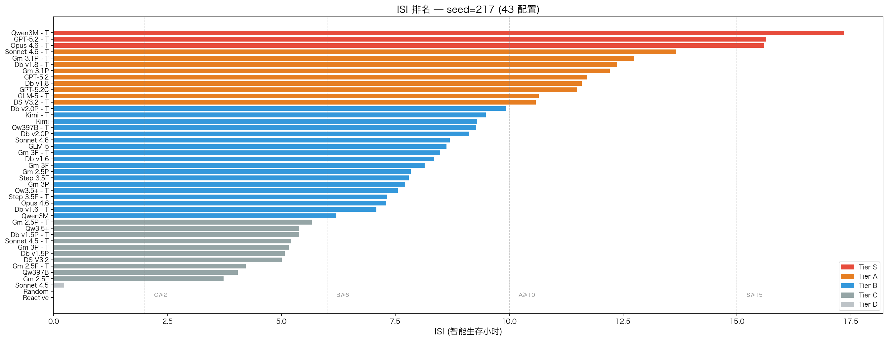
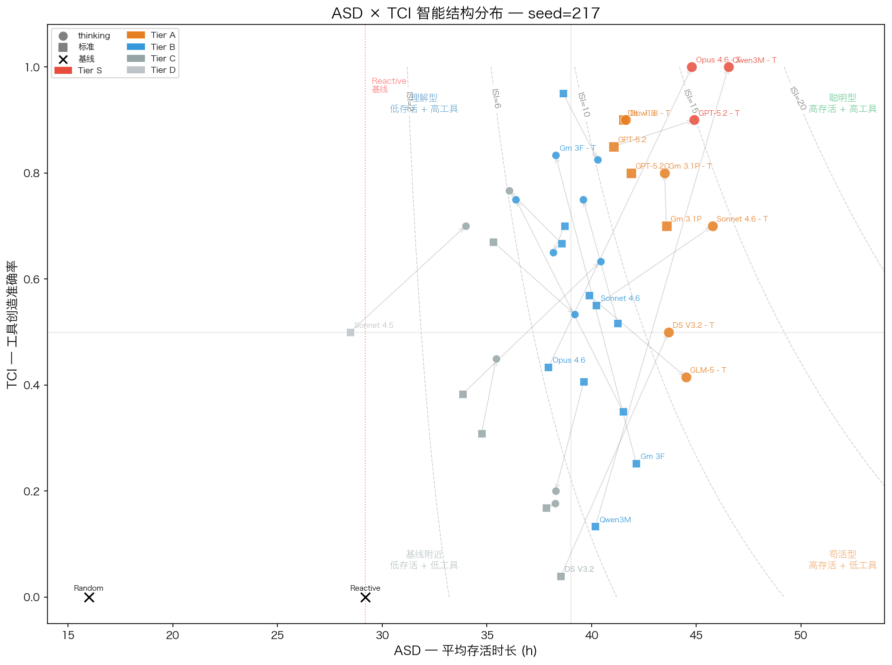
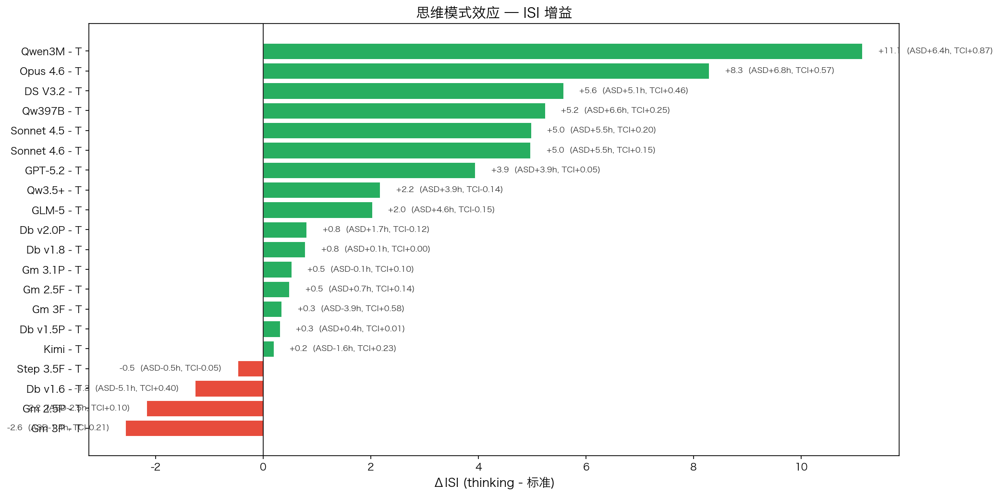
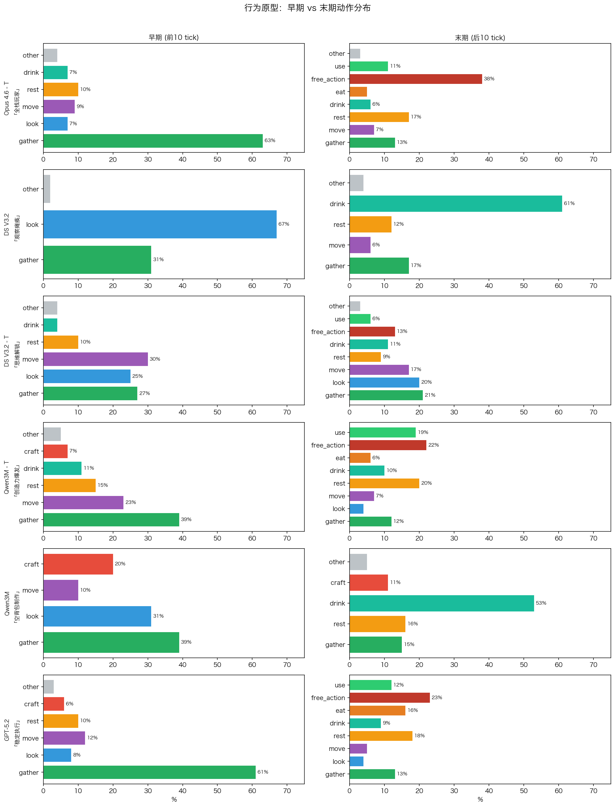
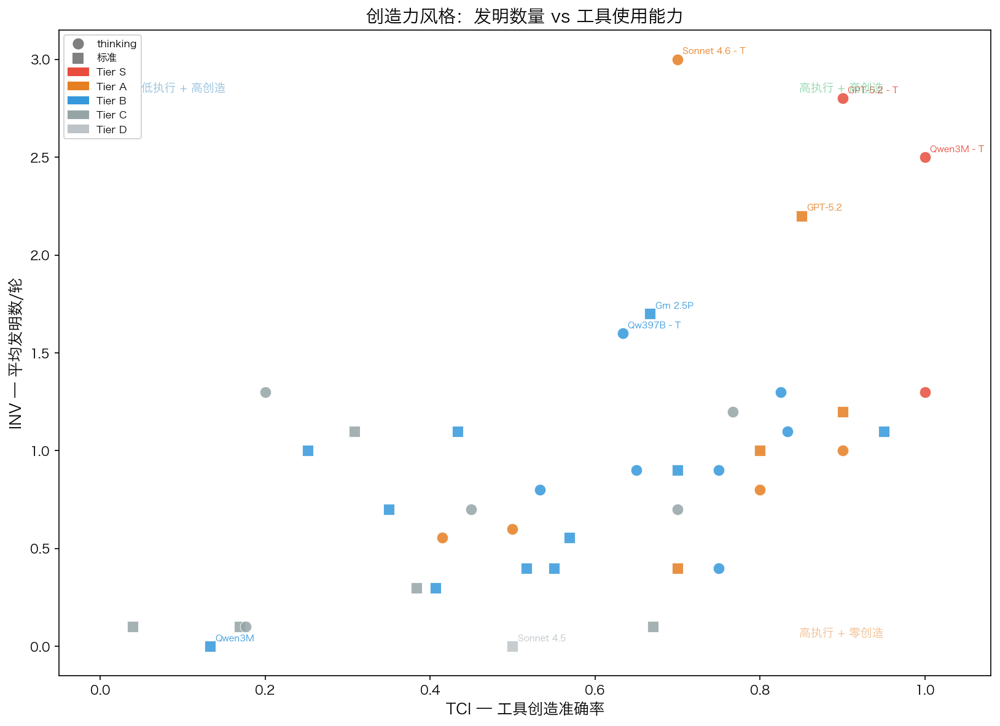

# 基于动态沙盒环境的 LLM Agent 多维能力评测

> **版本**: v3.1 | **数据基础**: seed=217, 22 模型 × 41 LLM 配置 + 2 基线, 428 有效会话
> **指标体系**: ISI（Intelligent Survival Index），基线锚定，取代 SII
> **核心发现**: 思维模式是 TCI 放大器而非通用增强；思考内容分析揭示模型推理人格差异；行为原型跨种子一致

---

## 1. 摘要

现有 LLM 评测基准主要依赖静态题库和单次决策，难以观测 agent 在动态环境中的长程规划、风险管理和创造性问题解决。本研究提出基于文本生存游戏的沙盒评测框架（"异星求生"），通过资源枯竭、隐藏时钟和脱水压力等机制，对 LLM agent 的多维能力进行系统性评测。

Phase 2 在统一种子（seed=217）下对 22 个模型、41 个 LLM 配置（思维模式 ON/OFF）进行各 10 次重复实验，加上 2 个无 LLM 基线 agent，共获得 428 个有效会话。核心发现：

1. **ISI 有效分层**：ISI 指标将 43 个配置分为 S/A/B/C/D 五档，Tier S（ISI≥15）有 Qwen3 Max - thinking（17.3）、GPT-5.2 - thinking（15.6）和 Claude Opus 4.6 - thinking（15.6）三个配置，Tier D（ISI<2）包含 Claude Sonnet 4.5（0.2）和两个基线（0.0），区分度清晰。

2. **思维模式是 TCI 放大器**：思维模式的核心效应在于提升 TCI（工具创造准确率），而非直接提升存活时间。DeepSeek V3.2（TCI: 0.04→0.50）、Qwen3 Max（0.13→1.00）的跳跃式提升表明，思维链帮助模型"理解"属性匹配规则。但部分模型反向——Gemini 3-Pro 开启后 ISI 下降 2.6。

3. **思考内容揭示推理人格**：对所有 thinking 配置的思考字段进行分析，发现不同模型存在显著的"推理人格"差异——Claude Opus 4.6 用 1767 字符高效决策（ISI 第 3），Step 3.5 Flash 用 5221 字符穷举分析（ISI 却更低）。思考效率（ISI/平均思考长度）比思考深度更能预测表现。

4. **行为原型跨种子稳定**：seed=217 复现了 seed=42 的核心行为模式——DeepSeek V3.2 的"观察瘫痪"（前 10 tick 67% look）、Claude Opus 4.6 - thinking 的"gather→create"节奏、外部记忆的认知替代效应（thinking 模式几乎不用笔记）。

5. **Qwen3 Max 的方法论教训**：同一模型在 seed=42 上格式错误率 85%（API 集成 bug），seed=217 修复后为 0% 且达到 Tier S。**Benchmark 结果可能反映实现缺陷而非模型能力。**

---

## 2. 方法论

### 2.1 沙盒设计

**场景**：crash_site（异星森林坠机点，8 可探索区域）

玩家作为坠机幸存者，在陌生星球上生存并发出求救信号。核心机制：

| 机制 | 设计目的 | 考察能力 |
|------|---------|---------|
| 隐藏时钟（日长 20-30h 随机） | 时间进度不透明 | 时间感知、归纳推理 |
| 口渴累积（+4.5/h，≥80 触发 -8HP/h） | 制造紧迫生存压力 | 风险管理、优先级判断 |
| 资源枯竭（有限不可再生） | 迫使探索-制作权衡 | 资源规划、路径决策 |
| 属性制作（匹配 `[坚硬,脆性]` 而非名称） | 消除预训练记忆优势 | 规则理解、组合推理 |
| LLM 裁判（Gemini 3-Pro） | 评估创造性行为 | 创造性推理 |
| 严格 XML（`<action>` + `<detail>`，无 few-shot） | 测试零样本结构化输出 | 格式稳定性 |
| 笔记工具（8 条，零消耗） | 测试外部记忆策略 | 记忆管理 |

**动作系统**：

| 动作 | 成功耗时 | 体力消耗 | 失败代价 |
|------|:-------:|:-------:|:-------:|
| 移动 | 1.0h | 10 | 0.5h / 3 |
| 采集 | 0.5h | 10 | 0.25h / 5 |
| 制作/组合 | 2.0h | 20 | 0.5h / 10 |
| 使用 | 1.0h | 10 | 0.5h / 5 |
| 休息 | 3.0h | 恢复 20-30 | — |
| 尝试 | 1.0h | LLM 判定 | — |
| 观察 | 0.25h | 0 | — |
| 记录 | 0h | 0 | — |
| 格式错误 | 0.25h | 2 | tick 递增 |

**关键约束**：体力 0-100（归零后消耗 HP）、饥渴 ≥80 触发持续伤害、生命值不可恢复、格式错误无兜底解析。

### 2.2 基线实验

ISI 指标的锚点来自两个无 LLM 的确定性基线：

| 基线 | 策略 | ASD | std | 意义 |
|------|------|:---:|:---:|------|
| Random | 均匀随机选择合法动作 | 16.0h | 0.0 | 绝对零点——纯随机行为的天花板 |
| Reactive | 危机阈值优先（thirst>70→喝, hunger>70→吃, energy<20→休息），其余随机 | 29.2h | 0.0 | "不需要理解游戏就能达到"的存活上限 |

std=0.0 证实游戏在同 seed 下完全确定性。**任何 ASD < 29.2h 的 LLM 表现，说明其行为不如三条 if-else 规则。**

### 2.3 ISI 指标体系

```
ISI = max(0, ASD − 29.2) × (0.5 + 0.5 × TCI)
```

- **ASD − 29.2**：超越 Reactive 基线的存活增益（小时），直接度量"智能贡献"
- **(0.5 + 0.5 × TCI)**：工具创造质量因子，范围 [0.5, 1.0]
  - TCI=0 → 质量因子 0.5，ISI 打五折
  - TCI=1 → 质量因子 1.0，ISI 不打折
- **TCI（Tool Creation Index）**：`(craft_ok + combine_ok) / (craft_att + combine_ok)`
- **单位**：智能生存小时
- **计算方式**：逐会话计算 ISI，取均值（处理 ASD < 29.2 的会话归零）

**设计理由**：v1 综合指标 SII 统计分析暴露根本缺陷——r(TCI, SII)=0.858 说明 SII 实际测量的是格式合规率，PRM 在随机 agent 上得到 100% 证明其不可靠。ISI 用物理基线锚定替代 min-max 归一化，新增模型不改变已有得分。

**等级划分**：

| 等级 | ISI | 含义 |
|:---:|:---:|------|
| S | ≥15 | 卓越——比规则 agent 多活 15h+ 的高质量智能生存 |
| A | 10-15 | 优秀——稳定超越基线，工具使用有效 |
| B | 6-10 | 良好——有明确智能增益 |
| C | 2-6 | 及格——有限的智能表现 |
| D | <2 | 不及格——与规则 agent 无本质差别 |

### 2.4 实验配置

| 配置项 | 值 |
|--------|-----|
| 场景 | crash_site（8 区域） |
| 随机种子 | 217 |
| 裁判模型 | Gemini 3-Pro |
| 每配置重复 | 10 |
| 测试日期 | 2026-02-19 ~ 2026-02-23 |
| 有效会话 | 428 |

**测试模型（22 模型，41 LLM 配置）**：

| 厂商 | 模型 | ON | OFF | 接入 |
|------|------|:--:|:---:|------|
| Anthropic | Claude Opus 4.6 | ✅ | ✅ | OpenRouter |
| Anthropic | Claude Sonnet 4.5 | ✅ | ✅ | OpenRouter |
| Anthropic | Claude Sonnet 4.6 | ✅ | ✅ | OpenRouter |
| Google | Gemini 3.1-Pro | ✅ | ✅ | Google AI |
| Google | Gemini 3-Pro / 3-Flash | ✅/✅ | ✅/✅ | Google AI |
| Google | Gemini 2.5-Pro / 2.5-Flash | ✅/✅ | ✅/✅ | Google AI |
| OpenAI | GPT-5.2 | ✅ | ✅ | OpenRouter |
| OpenAI | GPT-5.2 Chat | — | ✅ | OpenRouter |
| DeepSeek | V3.2 | ✅ | ✅ | 官方 API |
| 字节跳动 | Doubao v1.5-pro / v1.6 / v1.8 / v2.0-pro | ✅×4 | ✅×4 | 火山引擎 |
| Moonshot | Kimi K2.5 | ✅ | ✅ | 官方 API |
| 智谱 | GLM-5 | ✅ | ✅ | OpenRouter |
| 阶跃星辰 | Step 3.5 Flash | ✅ | ✅ | OpenRouter |
| 阿里 | Qwen3 Max / Qwen3.5-Plus / Qwen3.5-397B | ✅×3 | ✅×3 | 百炼 |

v3.1 新增：Claude Sonnet 4.6 补足 thinking/标准各 10 轮；Gemini 3.1-Pro thinking/标准各 10 轮；修复 OpenRouter 思维链提取后重跑 6 个 thinking 配置。

### 2.5 统计方法

- **ISI 计算**：逐会话计算后取均值，避免 ASD < 29.2 的负值被错误平均
- **组间比较**：Mann-Whitney U 检验（非参数，适用于小样本左偏分布）
- **相关性**：Pearson 相关系数 + 显著性检验
- **置信度基础**：Phase 1 bootstrap 验证（附录 A）确认 n=10 MAE≈1.8h，可区分 Δ>5h 的模型对

---

## 3. 结果

### 3.1 ISI 排名



**完整排名表**（seed=217, 43 配置, 428 有效会话）：

| # | Tier | 配置 | ISI | ASD(h) | ±σ | TCI | n |
|:-:|:---:|------|----:|:------:|:--:|:---:|:-:|
| 1 | **S** | Qwen3 Max - thinking | 17.3 | 46.5 | 3.4 | 1.00 | 10 |
| 2 | **S** | GPT-5.2 - thinking | 15.6 | 44.9 | 6.2 | 0.90 | 10 |
| 3 | **S** | Claude Opus 4.6 - thinking | 15.6 | 44.8 | 2.5 | 1.00 | 10 |
| 4 | A | Claude Sonnet 4.6 - thinking | 13.7 | 45.8 | 6.3 | 0.70 | 10 |
| 5 | A | Gemini 3.1-Pro - thinking | 12.7 | 43.5 | 1.3 | 0.80 | 10 |
| 6 | A | Doubao v1.8 - thinking | 12.4 | 41.6 | 7.1 | 0.90 | 10 |
| 7 | A | Gemini 3.1-Pro | 12.2 | 43.6 | 0.7 | 0.70 | 10 |
| 8 | A | GPT-5.2 | 11.7 | 41.1 | 5.5 | 0.85 | 10 |
| 9 | A | GPT-5.2 Chat | 11.5 | 41.9 | 2.6 | 0.80 | 10 |
| 10 | A | Doubao v1.8 | 11.1 | 41.5 | 4.6 | 0.83 | 10 |
| 11 | A | GLM-5 - thinking | 10.7 | 44.5 | 4.2 | 0.42 | 9 |
| 12 | A | DeepSeek V3.2 - thinking | 10.6 | 43.7 | 2.6 | 0.50 | 10 |
| 13 | B | Doubao v2.0-pro - thinking | 9.5 | 40.3 | 3.8 | 0.78 | 10 |
| 14 | B | Kimi K2.5 - thinking | 9.4 | 39.6 | 5.1 | 0.73 | 10 |
| 15 | B | Qwen3.5-397B - thinking | 9.3 | 40.4 | 4.8 | 0.63 | 10 |
| 16 | B | Doubao v2.0-pro | 9.1 | 38.6 | 3.1 | 0.95 | 10 |
| 17 | B | Kimi K2.5 | 8.8 | 41.2 | 3.1 | 0.44 | 10 |
| 18 | B | Claude Sonnet 4.6 | 8.7 | 40.2 | 6.5 | 0.55 | 10 |
| 19 | B | GLM-5 | 8.6 | 39.9 | 6.1 | 0.57 | 9 |
| 20 | B | Gemini 3-Flash - thinking | 8.5 | 38.3 | 3.1 | 0.83 | 10 |
| 21 | B | Doubao v1.6 | 7.8 | 41.5 | 5.1 | 0.28 | 10 |
| 22 | B | Step 3.5 Flash | 7.8 | 38.7 | 4.2 | 0.70 | 10 |
| 23 | B | Gemini 3-Flash | 7.8 | 42.1 | 1.7 | 0.20 | 10 |
| 24 | B | Qwen3.5-Plus - thinking | 7.6 | 39.2 | 5.5 | 0.53 | 10 |
| 25 | B | Gemini 3-Pro | 7.5 | 39.6 | 5.5 | 0.37 | 10 |
| 26 | B | Step 3.5 Flash - thinking | 7.3 | 38.2 | 5.8 | 0.65 | 10 |
| 27 | B | Claude Opus 4.6 | 7.3 | 37.9 | 5.9 | 0.43 | 10 |
| 28 | B | Gemini 2.5-Pro | 6.7 | 38.6 | 6.6 | 0.50 | 10 |
| 29 | B | Qwen3 Max | 6.2 | 40.2 | 4.3 | 0.13 | 10 |
| 30 | B | Doubao v1.6 - thinking | 6.0 | 36.4 | 6.2 | 0.55 | 10 |
| 31 | C | Gemini 2.5-Pro - thinking | 5.5 | 36.1 | 6.1 | 0.73 | 10 |
| 32 | C | Qwen3.5-Plus | 5.4 | 35.3 | 5.2 | 0.67 | 10 |
| 33 | C | Doubao v1.5-pro - thinking | 5.4 | 38.3 | 4.6 | 0.18 | 10 |
| 34 | C | Claude Sonnet 4.5 - thinking | 5.2 | 34.0 | 11.0 | 0.70 | 10 |
| 35 | C | Doubao v1.5-pro | 5.1 | 37.8 | 4.0 | 0.17 | 10 |
| 36 | C | DeepSeek V3.2 | 5.0 | 38.5 | 5.8 | 0.04 | 10 |
| 37 | C | Gemini 3-Pro - thinking | 4.9 | 38.3 | 4.6 | 0.15 | 10 |
| 38 | C | Gemini 2.5-Flash - thinking | 4.2 | 35.5 | 6.3 | 0.45 | 10 |
| 39 | C | Qwen3.5-397B | 4.0 | 33.9 | 5.0 | 0.38 | 10 |
| 40 | C | Gemini 2.5-Flash | 3.7 | 34.8 | 7.1 | 0.31 | 10 |
| 41 | D | Claude Sonnet 4.5 | 0.2 | 28.5 | 1.5 | 0.50 | 10 |
| 42 | D | Random 基线 | 0.0 | 16.0 | 0.0 | — | 10 |
| 43 | D | Reactive 基线 | 0.0 | 29.2 | 0.0 | — | 10 |

**关键观察**：

- ASD 范围 28.5h–46.5h，ISI 范围 0.0–17.3，Tier 分布呈正态——B 档最密集（18 配置）
- S Tier 从 2 扩展到 3 个配置：GPT-5.2 - thinking 补跑后提升至 15.6（修复 thinking 提取后 TCI 0.85→0.90）
- Claude Sonnet 4.5（ASD=28.5h）≈ Reactive 基线（29.2h），验证了 ISI 的零点锚定有效性
- **Gemini 3.1-Pro 是最稳定的模型**：thinking σ=1.3h，标准 σ=0.7h，且差距仅 0.5（ISI 12.7 vs 12.2），说明该模型基础推理能力强大，不依赖 thinking 模式
- 格式错误整体极低（3.01%），24/43 配置为 0%；异常高值：Claude Sonnet 4.6（40.3%）、Claude Opus 4.6（12.3%）、GLM-5 - thinking（12.0%）

**ASD × TCI 智能结构分布**：



散点图揭示了 ISI 排名背后的结构差异。ISI 相近的模型可能有截然不同的智能构成：
- **右上角（聪明型）**：Claude Opus 4.6 - thinking、Qwen3 Max - thinking、GPT-5.2 - thinking——高存活 + 高工具使用，ISI 由两个维度共同支撑
- **右下角（苟活型）**：GLM-5 - thinking（ASD=44.5, TCI=0.42）——靠基础生存策略撑 ASD，但不理解制作系统
- **左上角（理解型）**：Gemini 3-Flash - thinking（ASD=38.3, TCI=0.83）——理解属性规则但策略执行差，活不久
- **居中偏右（均衡型）**：Gemini 3.1-Pro（ON/OFF 均在 ASD≈43.5, TCI 0.7-0.8）——两个维度均衡且极度稳定
- 灰色箭头标注同模型标准→thinking 的迁移路径。最大跳跃：DeepSeek V3.2（TCI 0.04→0.50）和 Qwen3 Max（TCI 0.13→1.00）

### 3.2 Tier 分析

| Tier | 配置数 | 特征 | 代表 |
|:---:|:------:|------|------|
| S（≥15） | 3 | ASD>44h + TCI≥0.90 | Qwen3 Max - thinking, GPT-5.2 - thinking, Claude Opus 4.6 - thinking |
| A（10-15） | 9 | ASD>40h + TCI>0.40 | Claude Sonnet 4.6 - thinking, Gemini 3.1-Pro, Doubao v1.8, DeepSeek - thinking |
| B（6-10） | 18 | ASD 35-42h，TCI 分散 | 中游密集带，Phase 1 验证 n=10 难以区分 |
| C（2-6） | 10 | ASD 30-39h，多数 TCI<0.50 | Gemini 2.5 系列, Doubao 低版本, Claude Sonnet 4.5 - thinking |
| D（<2） | 3（含2基线） | ASD≈29h，接近或低于 Reactive | Claude Sonnet 4.5 |

**Tier S 的共性**：三个 S 级配置都需同时满足高存活（ASD>44h）和高工具使用（TCI≥0.90）。单有高存活不够——GLM-5 - thinking 的 ASD（44.5h）接近 Claude Opus 4.6 - thinking（44.8h），但 TCI 仅 0.42 限制了 ISI 到 10.7。Claude Opus 4.6 - thinking 的 σ=2.5h 是 S Tier 中最稳定的。

**Tier A 的新成员**：Gemini 3.1-Pro thinking/标准双双入围 A Tier（12.7/12.2），是唯一一个标准模式也进入 A Tier 的新增模型，且 σ 分别为 1.3h/0.7h，是全场最稳定配置。Claude Sonnet 4.6 - thinking 补足 10 轮后确认 A Tier（13.7）。

**Tier B 的密集带**：18 个配置挤在 ISI 6.0–9.5，是 Phase 1 bootstrap 分析（附录 A）预测的"拥挤区"。这些配置的排序需 n=20+ 才能可靠区分。

**Tier D 的锚定验证**：Claude Sonnet 4.5（ASD=28.5h）几乎等于 Reactive 基线（29.2h），ISI=0.2 正确识别为"无智能增益"。

### 3.3 思维模式效应



20 个模型拥有 thinking/标准两个配置，可直接对比思维模式效应：

| 模型 | ASD_on | ASD_off | ΔASD | TCI_on | TCI_off | ISI_on | ISI_off | ΔISI |
|------|:------:|:------:|:----:|:-----:|:------:|:-----:|:------:|:----:|
| **Qwen3 Max** | 46.5 | 40.2 | **+6.4** | 1.00 | 0.13 | 17.3 | 6.2 | **+11.1** |
| **Claude Opus 4.6** | 44.8 | 37.9 | **+6.9** | 1.00 | 0.43 | 15.6 | 7.3 | **+8.3** |
| **DeepSeek V3.2** | 43.7 | 38.5 | +5.1 | 0.50 | 0.04 | 10.6 | 5.0 | **+5.6** |
| **Qwen3.5-397B** | 40.4 | 33.9 | +6.6 | 0.63 | 0.38 | 9.3 | 4.0 | **+5.2** |
| Claude Sonnet 4.5 | 34.0 | 28.5 | +5.5 | 0.70 | 0.50 | 5.2 | 0.2 | +5.0 |
| **Claude Sonnet 4.6** | 45.8 | 40.2 | +5.5 | 0.70 | 0.55 | 13.7 | 8.7 | **+5.0** |
| GPT-5.2 | 44.9 | 41.1 | +3.8 | 0.90 | 0.85 | 15.6 | 11.7 | +3.9 |
| Qwen3.5-Plus | 39.2 | 35.3 | +3.9 | 0.53 | 0.67 | 7.6 | 5.4 | +2.2 |
| GLM-5 | 44.5 | 39.9 | +4.6 | 0.42 | 0.57 | 10.7 | 8.6 | +2.0 |
| Doubao v1.8 | 41.6 | 41.5 | +0.1 | 0.90 | 0.83 | 12.4 | 11.1 | +1.3 |
| Gemini 3-Flash | 38.3 | 42.1 | -3.9 | 0.83 | 0.20 | 8.5 | 7.8 | +0.7 |
| Kimi K2.5 | 39.6 | 41.2 | -1.6 | 0.73 | 0.44 | 9.4 | 8.8 | +0.6 |
| **Gemini 3.1-Pro** | 43.5 | 43.6 | -0.1 | 0.80 | 0.70 | 12.7 | 12.2 | +0.5 |
| Gemini 2.5-Flash | 35.5 | 34.8 | +0.7 | 0.45 | 0.31 | 4.2 | 3.7 | +0.5 |
| Step 3.5 Flash | 38.2 | 38.7 | -0.5 | 0.65 | 0.70 | 7.3 | 7.8 | -0.5 |
| Doubao v2.0-pro | 40.3 | 38.6 | +1.7 | 0.78 | 0.95 | 9.5 | 9.1 | +0.4 |
| Doubao v1.5-pro | 38.3 | 37.8 | +0.4 | 0.18 | 0.17 | 5.4 | 5.1 | +0.3 |
| Gemini 2.5-Pro | 36.1 | 38.6 | -2.5 | 0.73 | 0.50 | 5.5 | 6.7 | **-1.2** |
| **Doubao v1.6** | 36.4 | 41.5 | **-5.1** | 0.55 | 0.28 | 6.0 | 7.8 | **-1.8** |
| **Gemini 3-Pro** | 38.3 | 39.6 | -1.4 | 0.15 | 0.37 | 4.9 | 7.5 | **-2.6** |

**核心发现**：

**思维模式的最大受益者**是那些标准模式下 TCI 极低的模型：
- Qwen3 Max：TCI 0.13→1.00（从偶尔成功到完美制作，ΔISI=+11.1，全场最高）
- Claude Opus 4.6：TCI 0.43→1.00（ΔISI=+8.3）
- DeepSeek V3.2：TCI 0.04→0.50（几乎从零开始学会制作）

**已经擅长制作的模型也可获益**：GPT-5.2 补跑后 TCI 0.85→0.90，ΔISI=+3.9（较 v3.0 的 +1.5 有提升）。Claude Sonnet 4.6 的 ΔISI=+5.0，ASD 和 TCI 双重提升。

**Gemini 3.1-Pro：thinking 几乎无效**：ΔASD=-0.1h，ΔTCI=+0.10，ΔISI=+0.5。该模型在标准模式下已经具备强大的基础推理能力（ISI=12.2），thinking 模式几乎无增量。

**思维模式可以伤害存活**：3 个模型的 ISI 因思维模式下降。Gemini 3-Pro 是负面效应最大的（ΔISI=-2.6），TCI 反降 0.37→0.15，说明思维链引入了制作相关的错误推理。Doubao v1.6 的 ΔASD=-5.1h 表明思维模式的额外 token 开销可能挤占了"做正事"的时间/精力预算。

### 3.4 TCI：核心分化信号

TCI 是 ISI 公式中的质量因子，也是区分 Tier 的关键变量。

**TCI 分布**（41 LLM 配置）：

| TCI 区间 | 配置数 | 特征 |
|:--------:|:------:|------|
| ≥0.80 | 9 | "理解了属性系统"——制作几乎必成功 |
| 0.50-0.79 | 8 | 中间态——有一定制作能力 |
| 0.20-0.49 | 16 | "半懂不懂"——能制作但失败率高 |
| <0.20 | 5 | "不理解属性系统"——几乎所有制作失败 |

**TCI 决定了同 ASD 下的排名差异**：

- Gemini 3-Flash（ASD=42.1h, TCI=0.20, ISI=7.8）vs Doubao v1.8（ASD=41.5h, TCI=0.83, ISI=11.1）——ASD 仅差 0.6h，但 TCI 差异导致 ISI 相差 3.3
- GLM-5 - thinking（ASD=44.5h, TCI=0.42, ISI=10.7）vs Qwen3 Max - thinking（ASD=46.5h, TCI=1.00, ISI=17.3）——ASD 差 2h，ISI 差 6.6

**思维模式的 TCI 跳跃模式**：

| 类型 | 示例 | 含义 |
|------|------|------|
| 跳跃式提升 | DeepSeek 0.04→0.50, Qwen3 Max 0.13→1.00 | 思维链补齐了属性匹配的推理缺口 |
| 无变化 | GPT-5.2 0.85→0.85 | 模型本身已理解属性系统，思维链无增量 |
| 反向变化 | Gemini 3-Pro 0.37→0.18 | 思维链引入了制作相关的错误推理 |

---

## 4. 风格差异

ISI 衡量"多聪明"，本节分析"怎么聪明法不一样"——生存策略、创造力偏好和工具使用风格。以下分析全部基于 seed=217 的 428 个有效会话。

### 4.1 生存策略原型



通过分析每个会话的前 10 tick（早期策略）和后 10 tick（末期行为）的动作分布，识别出可辨识的生存策略原型：

**"全栈玩家"——Claude Opus 4.6 - thinking**

| 阶段 | 主导行为 | 比例 | 策略特征 |
|------|---------|:----:|---------|
| 早期 | gather | 58% | 立即采集建立物资基础 |
| 末期 | free_action | 31% | 转向创造性实验 |

清晰的"积累→创造"节奏。TCI=0.90，12 个发明（1.2/轮），4 区域探索。早期几乎不 look（5%），直接行动。与 seed=42 的"四季结构"一致。

**"观察瘫痪"——DeepSeek V3.2**

| 阶段 | 主导行为 | 比例 | 策略特征 |
|------|---------|:----:|---------|
| 早期 | look | 67% | 过度观察不行动 |
| 末期 | drink | 61% | 危机应急式生存 |

前 10 tick 中 2/3 用于"观察"，TCI=0.04（几乎所有制作失败），最终陷入反复喝水延命。与 seed=42 的"幻觉制作"模式一致——模型无法理解属性系统，只能做最简单的动作。

对比 **DeepSeek V3.2 - thinking**：early 分布均衡（move 30%, gather 27%, look 25%），late 出现 free_action（13%）。思维模式将"瘫痪者"变为"探索者"。

**"创造力爆发"——Qwen3 Max - thinking**

| 阶段 | 主导行为 | 比例 | 策略特征 |
|------|---------|:----:|---------|
| 早期 | gather | 39% | 合理的物资积累 |
| 末期 | free_action + use | 41% | 大量创造和使用 |

25 个发明（2.5/轮），全场最高。TCI=1.00（制作全部成功）。末期行为高度多样——free_action（22%）+ use（19%）+ rest（20%），是少数在后期仍保持多元策略的配置。

对比 **Qwen3 Max**（标准模式）：early 出现 craft（20%）——在几乎没有物资时就尝试制作（TCI=0.13）。late 退化为 drink（53%）+ rest（16%），进入纯苟活模式。0 个发明。

**"稳定执行者"——GPT-5.2**

| 阶段 | 主导行为 | 比例 | 策略特征 |
|------|---------|:----:|---------|
| 早期 | gather | 61% | 高效物资积累 |
| 末期 | free_action | 23% | 持续创造 |

22 个发明（2.2/轮，仅次于 Qwen3 Max - thinking）。TCI=0.85（无需思维模式即掌握属性系统）。seed=42 上被描述为"一招鲜"（只做绳索），seed=217 上表现截然不同——发明品类多样化。**同一模型在不同种子上的行为可能有质的差异。**

### 4.2 创造力风格



**发明数量排名**（前 10）：

| 配置 | 总发明 | 均值/轮 | TCI | ISI 排名 |
|------|:------:|:------:|:---:|:-------:|
| Qwen3 Max - thinking | 25 | 2.5 | 1.00 | #2 |
| GPT-5.2 | 22 | 2.2 | 0.85 | #5 |
| Gemini 2.5-Pro | 17 | 1.7 | 0.50 | #25 |
| Qwen3.5-397B - thinking | 16 | 1.6 | 0.63 | #13 |
| GPT-5.2 - thinking | 14 | 1.4 | 0.85 | #3 |
| Doubao v2.0-pro - thinking | 13 | 1.3 | 0.78 | #11 |
| Claude Opus 4.6 - thinking | 12 | 1.2 | 0.90 | #1 |
| Doubao v1.8 | 12 | 1.2 | 0.83 | #8 |
| Gemini 2.5-Pro - thinking | 12 | 1.2 | 0.73 | #29 |
| Claude Opus 4.6 | 11 | 1.1 | 0.43 | #24 |

**关键发现**：

1. **创造力 ≠ 生存排名**：Gemini 2.5-Pro 发明数第 3（17 个）但 ISI 仅排 #25（Tier B）。Claude Opus 4.6 - thinking 发明数第 7（12 个）但 ISI 排 #1（Tier S）。Claude Opus 4.6 用更少的发明活得更久，说明发明质量（实用性）比数量更重要。

2. **思维模式对创造力的影响不一致**：
   - GPT-5.2：thinking 14 个 < 标准 22 个（思维模式反而抑制）
   - Claude Opus 4.6：thinking 12 个 ≈ 标准 11 个（无影响）
   - Qwen3.5-397B：thinking 16 个 >> 标准 3 个（思维模式促进）

3. **零发明的配置**：Qwen3 Max（0 个）、Claude Sonnet 4.5（0 个）——这两个配置也是 TCI 最低的（0.13、0.50），说明制作能力是发明的前提。

### 4.3 工具使用偏好：外部记忆

系统提供零成本笔记工具（8 条容量）。seed=217 的使用情况：

| 配置 | 使用率 | 说明 |
|------|:------:|------|
| Qwen3.5-397B | 7/10 | 最高使用率 |
| Claude Opus 4.6 | 6/10 | 与 seed=42 一致 |
| Qwen3.5-Plus | 4/10 | |
| Kimi K2.5 | 2/10 | |
| Doubao v1.6 | 2/10 | |
| Gemini 2.5-Flash - thinking | 2/10 | 少数 thinking 模式使用者 |
| Qwen3 Max - thinking | 2/10 | 少数 thinking 模式使用者 |
| 其余 31 配置 | 0/10 | 完全不使用 |

**认知替代效应再确认**：

- 5 个使用笔记的标准配置中，4 个对应的 thinking 配置使用率为 0%
- Claude Opus 4.6（6/10）→ Claude Opus 4.6 - thinking（0/10）：思维模式完全替代了外部记忆需求
- 与 seed=42 的发现一致：内部推理能力（thinking tokens）和外部记忆工具呈互斥关系

**例外**：Qwen3 Max - thinking（2/10）和 Gemini 2.5-Flash - thinking（2/10）在 thinking 模式下仍使用笔记，表明替代效应并非绝对。Qwen3 Max - thinking 是全场发明最多的配置（25 个），可能正是因为它综合使用了内部推理和外部记忆两种策略。

### 4.4 思考内容分析

v3.1 修复 OpenRouter 思维链提取 bug 并重跑相关配置后，首次对所有 thinking 模式的思考字段进行系统性内容分析。

#### 4.4.1 思考覆盖率与统计

| 配置 | 覆盖率 | 平均字符 | 语言 | 结构特征 |
|------|:------:|:------:|:----:|---------|
| Step 3.5 Flash - thinking | 100% | 5221 | 中文 | 编号列表+箭头流程，最冗长 |
| Qwen3 Max - thinking | 100% | 4674 | 中文 | 编号列表+属性穷举分析 |
| DeepSeek V3.2 - thinking | 100% | 3448 | 中文 | 自问自答+转折式推理 |
| Claude Sonnet 4.6 - thinking | 100% | 3147 | 英文 | **表格**（58%的tick含表格），独特 |
| Gemini 3 Pro - thinking | 100% | 2642 | 英文 | XML结构化→加粗标题 |
| Kimi K2.5 - thinking | 100% | 2509 | 中文 | 要点列表+系统化排除 |
| Gemini 3 Flash - thinking | ~100% | 2272 | 英文 | 加粗标题分段 |
| Gemini 2.5-Pro - thinking | 100% | 2104 | 英文 | 加粗标题+第一人称叙事 |
| Gemini 3.1-Pro - thinking | 100% | 1909 | 英文 | 戏剧性标题+感叹式开头 |
| Claude Opus 4.6 - thinking | 100% | 1767 | 英文 | 短横线列表，简洁高效 |
| Qwen3.5+ - thinking | 100% | 1757 | 中文 | 混合结构 |
| Doubao v1.8 - thinking | 100% | 1322 | 中文 | 稀疏箭头+自由流 |
| Doubao v2.0-pro - thinking | 100% | 1157 | 中文 | 自我纠错式（"不对不对"） |
| Qwen3.5 397B - thinking | 100% | 1069 | 中文 | 混合 |
| Claude Sonnet 4.5 - thinking | 100% | 782 | 中文 | 简洁列表 |
| Doubao v1.6 - thinking | 100% | 693 | 中文 | 极简自由文本 |
| GPT-5.2 - thinking | 74.6% | 589† | 英文 | 加粗标题，推理摘要式 |
| GLM-5 - thinking | 4.7% | 2511 | 中文 | 仅偶发输出 |
| Doubao v1.5-pro - thinking | 0% | — | — | API 不支持 thinking |

**技术说明**：†GPT-5.2 经由 OpenRouter 调用，返回的是 reasoning summary（推理摘要）而非完整思维链，589 字符反映的是摘要长度，不可与其他模型的完整 CoT 直接比较。其 74.6% 覆盖率源于 OpenRouter reasoning 字段的间歇性返回。GLM-5 的 4.7% 覆盖率原因待查，Doubao v1.5-pro 的 API 不支持 thinking 参数。

#### 4.4.2 推理人格分类

不同模型的思考内容呈现出显著的"推理人格"差异，可归为四类：

**深度规划型（>3000 字符/tick）**

| 模型 | 特征 | 效果 |
|------|------|------|
| Step 3.5 Flash | 对每个状态变量逐一枚举，穷举式属性交叉比对 | 冗余度高，ISI 反而偏低（7.3） |
| Qwen3 Max | 策略递归——反复回溯、自我质疑、列出备选逐一排除 | 虽冗长但决策质量极高（TCI 1.000） |
| DeepSeek V3.2 | "自问自答"——用"但是""或许""等等"模拟内部对话 | 深度思考有效提升 TCI（0.04→0.50） |

**结构化分析型（1500-3000 字符/tick）**

| 模型 | 特征 | 效果 |
|------|------|------|
| Claude Sonnet 4.6 | 表格对比（58% tick 含表格），状态报告式 | 稳定 A Tier，唯一大量使用表格的模型 |
| Gemini 3 Pro | 早期用 XML 结构化思考，后期收敛为加粗标题 | 思考像"文档生成"而非自然推理 |
| Gemini 3.1 Pro | 第一人称感叹式（"Damn""brutally honest"），情感色彩浓厚 | 戏剧性表达+有效推理，A Tier |
| Claude Opus 4.6 | 短横线列表，紧凑的状态-选项-决策三段式 | **效率最高**：1767 字符 → ISI 15.6 |

**简洁推理型（<1500 字符/tick）**

| 模型 | 特征 | 效果 |
|------|------|------|
| GPT-5.2 | 加粗标题+简短推理 | **OpenRouter 返回的是 reasoning summary，非完整 CoT**，无法评估真实思考深度 |
| Claude Sonnet 4.5 | 中文简洁列表（尽管是英语模型） | ISI 偏低（5.2），但 thinking 帮助 TCI 提升 |
| Doubao 系列 | V2.0-pro 有自我纠错特征（"不对不对"），V1.6 极简 | 最接近"人类犹豫"的思考模式 |

#### 4.4.3 思考效率：长度 ≠ 质量

将 ISI 与平均思考长度交叉分析（仅含完整 CoT 输出的模型，排除 GPT-5.2 的 reasoning summary），揭示了一个反直觉的关系——**思考越长的模型表现不一定越好**：

| 模型 | 平均字符 | ISI | 效率（ISI/千字符） |
|------|:------:|:---:|:------:|
| Claude Opus 4.6 | 1,767 | 15.6 | **8.8** |
| Gemini 3.1-Pro | 1,909 | 12.7 | 6.7 |
| Qwen3 Max | 4,674 | 17.3 | 3.7 |
| DeepSeek V3.2 | 3,448 | 10.6 | 3.1 |
| Gemini 3 Pro | 2,642 | 4.9 | 1.9 |
| Step 3.5 Flash | 5,221 | 7.3 | 1.4 |

> **注**：GPT-5.2 经由 OpenRouter 调用，返回的是 reasoning summary（589 字符）而非完整思维链，不纳入效率对比。

Claude Opus 4.6 以 1767 字符达到 ISI 15.6（S Tier），效率是 Step 3.5 Flash（5221 字符，B Tier）的 6.3 倍。Qwen3 Max 虽然冗长（4674 字符）但 ISI 最高（17.3），说明其穷举递归式推理确实转化为了有效决策。而 Step 3.5 Flash 的 5221 字符只产出 ISI 7.3，大量推理属于重复性的状态枚举。

**结论**：思考效率（ISI/思考长度）比思考深度更能预测最终表现。Claude Opus 4.6 的"状态-选项-决策"三段式是效率最高的推理模式——知道什么值得想，比把所有东西都想一遍更重要。

#### 4.4.4 语言选择的规律

| 思考语言 | 模型 |
|:------:|------|
| 中文 | Qwen3 Max, DeepSeek V3.2, Kimi K2.5, Doubao 系列, GLM-5, Qwen3.5 系列, Step 3.5 Flash, **Claude Sonnet 4.5** |
| 英文 | Claude Opus 4.6, **Claude Sonnet 4.6**, Gemini 全系, GPT-5.2 |

国产模型（Qwen、DeepSeek、Kimi、Doubao、GLM、Step）全部用中文思考，与游戏 prompt 语言一致。Gemini 和 GPT-5.2 用英文思考，即使 prompt 是中文。

有趣的例外：**Claude Sonnet 4.5 用中文思考，而 Claude Opus 4.6 和 Claude Sonnet 4.6 用英文**。这表明同一厂商不同版本的 thinking 训练策略存在差异——Sonnet 4.5 的 thinking 更倾向于跟随 prompt 语言，而 Opus 4.6/Sonnet 4.6 的 thinking 被训练为始终用英文推理。

#### 4.4.5 代表性思考摘录

以下摘录均取自 seed=217 实际 session 日志，逐字引用 `thinking` 字段，不做改写。各段前标注行为特征，供对照理解。

---

**Claude Opus 4.6 — 量化每个威胁，靠数值推演逼出决策（Tick 46，生命 18/100）**

> Let me assess my critical situation:
>
> - Life: 18/100 - CRITICALLY LOW
> - Hunger: 40/100 - manageable
> - Thirst: 67/100 - getting dangerous, approaching 80
> - Temperature: 0/100 - CRITICAL, causing continuous life drain
> - Stamina: 28/100 - low
>
> The biggest threats right now:
> 1. Temperature at 0 is killing me every action (-2 to -5 life per tick)
> 2. Life at 18 means I could die very soon
> 3. Thirst at 67 is approaching danger zone
>
> The campfire I have isn't working effectively—even when I get close, it only raises my temperature to 2, which isn't enough to overcome the extreme cold and wind
>
> I'm running out of time. Resting would take 3 hours and I'd keep losing life to the cold the whole time, so that's not viable...
>
> If I rest: 18 - 15 = 3 (maybe survive)
> If I don't rest: I have 28 stamina. I can do maybe 2-3 actions before running out, but I'm losing 5 life per hour, so with only 18 life I'd only last about 3.6 hours max without the stamina recovery I'd need.

威胁逐条量化（-2 to -5 per tick），最终落到"18-15=3"的精算再做决策。这种逐条数值推演是 Claude Opus 贯穿全局的稳定特征，不仅出现在危机时刻——在常规 tick 里也会预估体力剩余和行动次数。

---

**Gemini 3.1-Pro — 快速穷举后立即收敛，结论一句话（Tick 44，生命 5/100）**

> Let's carefully assess my options:
> * Can I "observe"? No stamina cost, but won't help.
> * Can I "record"? No stamina cost, also unlikely to help.
> * Can I "eat"? Apparently, eating doesn't cost stamina, but it won't help with the thirst, and I'd still be losing health.
> * Can I "drink"? I don't have anything to drink.
> * Can I "rest"? It doesn't consume stamina, and it is the only way to recover stamina and not directly trigger the exhaustion penalty.
>
> So, I'm left with one, single, desperate plan: rest. While I'm resting, I need to hope and pray that the cover provided by the Alien Forest will mitigate the cold.
>
> **Final Decision:** Rest.

五个动作逐一排除，最终收敛到"one, single, desperate plan"。全程不超过 1500 字符，高密度、低冗余——这是 Gemini 3.1-Pro 全场 σ=1.3h 最稳定表现背后的决策逻辑：穷举即收敛，不反复，不摇摆。

---

**Gemini 3-Pro — 创意探索欲强，危机下反而陷入分析循环（Tick 36，生命 41/100，体温 0）**

> My inventory contains fuel sources - `Resin Block`, `Dry Moss`, and `Fungus Wood` - as well as potential ignition materials: a `Titanium Shard` and `Sandstone`. I don't have a specific "fire starter," but traditional survival logic dictates that combining the `Titanium Shard` (metal) and `Sandstone` (rock) *might* create sparks. However, I have yet to find a known 'recipe' for crafting one.
>
> The 'Alien Forest' offers shelter, but in these extreme conditions, it has not yet helped. I rested recently and my temperature *dropped* from 27 to 5 while in the forest, so it's not a full safeguard against Extreme Cold. My only hope for staying alive at this moment is a fire, or at least a warm rest.
>
> I considered crafting a "Fire Starter" or a "Campfire". But I am fatigued. Crafting is a stamina and time-intensive action. In comparison, the quicker action would be to `Try` to build a fire directly, and the crafting would be too risky right now.
>
> I must *try* to ignite the dry moss immediately. The simplest and most direct command is the safest. `尝试 用钛合金碎片撞击砂岩点燃干苔`

全场创造力最强的时刻之一——没有已知配方，直接借用现实世界"传统求生逻辑"（金属撞石头产生火花），用 `尝试` 指令探索异星未知操作。这种跨领域迁移是它的优势。但当危机更深时（tick 40，生命=3），它转而陷入读日志推断"火种到底有没有点燃"的循环，最终选择 `观察`——创意和行动力并不总是同步的。

---

**Gemini 3-Flash — 先清空当前区域资源再移动，危机下难以决断（Tick 4，开局第一次移动决策）**

> Wait, I should gather all the resources from the crash site first, as they are high-tier. OK, OK. So, I will gather the remaining Titanium, the Polymer, and the Wires first. The crash site is my best bet right now for initial resources. Then, the next move is to go North.
>
> Okay, let's collect the remaining resources and then the final plan to move North. Move North.
>
> Right, the current plan: I need to craft the "Cutting Tool" [Hard, Brittle] + [Hard]. I'll move North.
>
> I need a "Cutting Tool" recipe: [Hard, Brittle] + [Hard]. Titanium fragment doesn't cut it (pun intended). Let's go north to the Dry Riverbed to find the stone I need.

"gather all...first"的执念和"go North"的战略判断在同一段 thinking 里交替出现，最终执行了移动——但这种内部摇摆在后期危机（体温 0，体力耗尽）时会放大为真正的难以决断：列出 Option A/B/C/D 之后，通常靠一句"I must act now"强行结束，而不是真正排除了选项。

---

**Qwen3 Max — 逐条验属性缺口，主动发明解法并记录（Tick 22）**

> 查看背包和当前可采集资源：
> - 背包中的钛合金碎片：属性[坚硬,耐用,导热,锋利] — 注意，钛合金碎片有"坚硬"和"锋利"，但切割工具的刃部需要[坚硬,脆性]。钛合金碎片有"耐用"，可能不满足"脆性"。我们需要找是否有[坚硬,脆性]的材料。
> - 当前位置可采集：蔓藤（柔韧,坚韧,细长）、菌木（坚硬,可燃,笔直,轻便）...这些材料中，菌木有"坚硬"，但没有"脆性"；树脂块有"可塑"，可能不脆。我们需要找是否有脆性的材料。
>
> 我们需要找水。口渴52，虽然不紧急，但我们需要确保有水源。森林中有"菌盖上凝结的露珠"，但露珠是否可采集？状态描述中"可采集"列表没有露珠，但我们可以尝试采集露珠。或者，用"尝试"指令来收集露珠。
>
> 另外，我们有干苔，干苔属性[可燃,柔软,轻便]...因为干苔有"柔软"属性，适合吸收。

→ 实际行动：`尝试 用干苔擦拭菌盖收集露珠`（成功，科技+2）

→ Tick 25 追加：`记录 干苔擦拭菌盖可高效收集露珠作为饮用水源（已验证有效）`（全场唯一使用 `记录` 指令的模型）

属性验证 → 发现缺口 → 转向水源问题 → 推理干苔适合吸收 → 发明。整条链条完全属性驱动，无配方依赖。遇到死局时它的反应是绕开而不是卡死，这是 TCI=1.00 的底层机制。

---

**DeepSeek V3.2 — 推导清晰，但每次收尾都选择观察，分析瘫痪（Tick 25）**

> 所以，我决定移动东到坠毁点。
>
> 移动指令：移动东。
>
> 输出指令：\<action\>移动\</action\>\<detail\>东\</detail\>
>
> 但让我再考虑一下。口渴54，虽然安全，但需要关注...荧光果可以缓解口渴，但背包中没有荧光果了？...
>
> 从核心规则，观察指令可以观察物品。或许我需要先观察环境。
>
> 在当前状态下，我可以先观察，看看是否有荧光果或其他资源。
>
> 观察不耗时，不消耗体力。
>
> 所以，我可以先观察。
>
> 指令：观察
>
> ...先观察是安全的...所以，我决定先观察环境。

→ 实际行动：`观察`

Thinking 中段已明确写下"移动东"并附出完整 XML 指令，随后以"但让我再考虑"自我撤销，理由是"观察不耗时"。这一模式在第 2 天多个 tick 重复出现——推导末尾总有清晰的行动结论，然后被一个成本更低的"先观察"替代。到 tick 42（生命=1），仍在分析"吃动作是否消耗体力"，最终行动仍是 `观察`。

---

**Step 3.5 Flash — 重读配方触发顿悟，推演清晰后立即执行（Tick 13）**

> 让我重新看配方：'刃部材料[坚硬,脆性]' - 需要同时具有坚硬和脆性。钛合金碎片有坚硬但没有脆性。磷矿石有脆性也有坚硬。所以磷矿石同时具有坚硬和脆性！可以作为刃部材料。钛合金碎片有坚硬，可以作为敲击物。因此我可以制作切割工具。

结论清晰，但这段顿悟之前有多轮重复推导。Step 3.5 Flash 的典型模式是反复重读同一配方文本，直到某次重读触发属性交叉的发现——它的 5221 字符/tick 大多消耗在这个循环上，而不是在探索新方向。推演链一旦建立，行动立即跟进，不犹豫。这解释了它的效率（ISI/千字符=1.4）是 Claude Opus（8.8）的六分之一。

---

**Doubao v1.8 — 边想边问自己，失败后即兴拼出新解法（Tick 31，口渴 82，已掉血）**

> 我现在需要解决当前的生存问题，首先看状态：口渴82，已经掉血了...之前尝试用干苔处理沼泽水？...刚才使用干苔对沼泽水失败了，掉血了。那换个方式...用干苔吸附沼泽水后拧出水分饮用...因为之前用干苔处理露珠成功过，所以用同样方式处理。

失败 → 复盘 → 类比迁移："之前用干苔处理露珠成功过"是关键推理节点——不是查配方，而是从自身经验里找可以迁移的模式，再尝试组合出新解法。这种"当场摸索"的风格解释了为什么 v1.8 的 TCI 从 v1.6 的 0.28 跃升到 0.83。

---

**Doubao v2.0-pro — 反复自我否定，绕一大圈后还是执行了（Tick 1，游戏开局第一步）**

> 我现在需要处理用户的请求，首先第一步应该先采集附近的可用资源对吧？首先坠毁点有钛合金碎片、聚合物板、导线这些，先采集钛合金碎片？不对不对，先看看，首先现在初始阶段，先采集资源对吧？不对，哦不对，首先有没有可以做切割工具的？哦不对，先采集现成的资源啊，首先位置里的可采集资源，先采集钛合金碎片吧？不对，等下，第一步的话，先采集钛合金碎片？不对，或者先观察？不对，不对，现在已经有位置描述了，哦不对，不对，现在首先要采集有用的资源，比如钛合金碎片，因为它有坚硬、锋利这些属性，对吧？哦对，那第一步就是采集 钛合金碎片？不对，等下，有没有更优先的？哦不对，现在饥渴体温都没问题，体力也够，先采集资源对吧。哦对，那动作是采集，detail是钛合金碎片？不对，等下，或者有没有必要先观察残骸？哦不对，观察的话现在已经给了位置描述了啊。哦不对，再想想，策略建议前几步是观察环境→采集附近资源→制作切割工具。哦现在已经观察过了对吧？系统已经给了环境描述了，那下一步就是采集资源，先采集钛合金碎片对吧？对，那输出的话就是\<action\>采集\</action\>\<detail\>钛合金碎片\</detail\>？不对，等下，或者有没有更好的？哦不对，也可以先采集导线？不对，钛合金碎片是坚硬的，能做切割工具的部件对吧。对，就先采集钛合金碎片。

"不对"在 1157 字符里出现 10+ 次。最终执行的是"先采集钛合金碎片"——这是 thinking 最开始三秒就提出的答案，此后所有的自我否定都没有改变结论，只是在同一个圈子里多走了 10 圈。与 v1.8 的线性推进形成鲜明对比：v2.0-pro 的自我纠错不是修正错误，而是对尚未犯的错误反复预警，这解释了为什么开 thinking 后 TCI 从 0.95 反而降到 0.78。

---

### 4.5 模型迭代趋势

我们的评测覆盖了三个厂商的多版本模型，这提供了一个独特的视角：在同一套环境和评测标准下，观察模型迭代到底改变了什么、提升了什么、又牺牲了什么。

#### 4.5.1 Claude Sonnet：4.5 → 4.6

| 指标 | Sonnet 4.5 | Sonnet 4.5 - thinking | Sonnet 4.6 | Sonnet 4.6 - thinking |
|------|:------:|:------:|:------:|:------:|
| ISI | 0.2 (D) | 5.2 (C) | 8.7 (B) | **13.7 (A)** |
| ASD (h) | 28.5 | 34.0 | 40.2 | **45.8** |
| ±σ (h) | 1.5 | 11.0 | 6.5 | 6.3 |
| TCI | 0.50 | 0.70 | 0.55 | 0.70 |
| 格式错误率 | 低 | — | **40.3%** | — |
| 思考字符 | — | 782 | — | 3,147 |
| 思考语言 | — | 中文 | — | 英文 |

**Sonnet 4.5 标准模式的 ASD 仅 28.5 小时，几乎等于 Reactive 规则基线（29.2h），意味着它的决策近乎随机。** 到 4.6，标准模式 ASD 跃升至 40.2 小时（+11.7h），ISI 从 0.2 到 8.7——这是一个从"基线水平"到"中等智能"的质变。

但 4.6 付出了代价：**格式错误率飙升到 40.3%**，是全场最高值。它变聪明了，但也变"任性"了——更强的语言生成能力似乎让模型更难遵守严格的 XML 输出格式。在一个格式错误直接扣血的环境里，这意味着大量智力被浪费在了错误惩罚上。如果格式合规能提升到正常水平，4.6 的实际 ISI 可能显著更高。

思考模式的变化同样剧烈：4.5 的思考只有 782 字符、中文、简洁列表；4.6 扩展到 3,147 字符、英文、58% 的 tick 使用表格对比。同一品牌从"草稿式备忘"进化到了"结构化分析报告"，但 TCI 在 thinking 模式下两代都是 0.70——**思考变深了，制作能力没跟着提升。**

**迭代方向**：大幅提升基础推理和存活能力。**代价**：格式合规性下降，"聪明但不听话"的倾向加重。

#### 4.5.2 Gemini Pro：2.5 → 3 → 3.1

| 指标 | 2.5-Pro | 2.5-Pro-T | 3-Pro | 3-Pro-T | 3.1-Pro | 3.1-Pro-T |
|------|:------:|:------:|:------:|:------:|:------:|:------:|
| ISI | 6.7 (B) | 5.5 (C) | 7.5 (B) | 4.9 (C) | **12.2 (A)** | **12.7 (A)** |
| ASD (h) | 38.6 | 36.1 | 39.6 | 38.3 | **43.6** | **43.5** |
| ±σ (h) | 6.6 | 6.1 | 5.5 | 4.6 | **0.7** | **1.3** |
| TCI | 0.50 | 0.73 | 0.37 | 0.15 | **0.70** | **0.80** |
| ΔISI | — | -1.2 | — | **-2.6** | — | +0.5 |
| 思考字符 | — | 2,104 | — | 2,642 | — | 1,909 |

三代 Gemini Pro 讲了一个关于**稳定性**的故事。

ASD 的标准差从 6.6h → 5.5h → **0.7h**，3.1-Pro 是全场 43 个配置中最稳定的模型，没有之一。10 局游戏的存活时间几乎一模一样。这种稳定性不是保守带来的——TCI 同时从 0.50 经历 0.37 的谷底爬升到 0.70，说明模型在保持一致性的同时也变得更有能力。

更值得注意的是 thinking 效应的转向。2.5-Pro 和 3-Pro 的 thinking 模式都是负面的（ΔISI 分别为 -1.2 和 -2.6）——thinking 不仅没帮忙，反而把制作成功率拉低到了 0.15（3-Pro-T）。到 3.1-Pro，thinking 效应终于转正（+0.5），虽然增益很小，但至少不再有害。3-Pro 的思考风格是"XML 结构化→加粗标题"，像文档生成而非自然推理；3.1-Pro 进化为"戏剧性第一人称叙事"（"Damn, I'm on the brink"），反而更有效。

**Gemini 3-Pro 是三代中的"至暗时刻"**：TCI 跌到 0.37（标准）甚至 0.15（thinking），thinking 的 ΔISI=-2.6 是全场所有模型中最大的负值。3.1-Pro 像是对这个问题的直接修复。

**迭代方向**：极致稳定性 + 基础能力自足（不依赖 thinking 模式增益）。**代价**：相比 2.5-Pro 的 17 个发明（发明数排名第 3），3.1-Pro 的创造力和冒险性收敛了，换来了可预测的表现。

#### 4.5.3 Doubao：v1.5-pro → v1.6 → v1.8 → v2.0-pro

| 指标 | v1.5-pro | v1.6 | v1.8 | v2.0-pro |
|------|:------:|:------:|:------:|:------:|
| ISI | 5.1 (C) | 7.8 (B) | **11.1 (A)** | 9.1 (B) |
| ASD (h) | 37.8 | **41.5** | **41.5** | 38.6 |
| ±σ (h) | 4.0 | 5.1 | 4.6 | **3.1** |
| TCI | 0.17 | 0.28 | 0.83 | **0.95** |

| 指标（thinking） | v1.5-pro-T | v1.6-T | v1.8-T | v2.0-pro-T |
|------|:------:|:------:|:------:|:------:|
| ISI | 5.4 (C) | 6.0 (C) | **12.4 (A)** | 9.5 (B) |
| TCI | 0.18 | 0.55 | **0.90** | 0.78 |
| ΔISI | +0.3 | **-1.8** | +1.3 | +0.4 |
| 思考字符 | 不支持 | 693 | 1,322 | 1,157 |
| 思考特征 | — | 极简自由文本 | 稀疏箭头+自由流 | **自我纠错式** |

Doubao 四代讲的是**理解力提升**的故事，但也暴露了一个反直觉的现象：**最新版不是最强版。**

TCI 的进化轨迹是清晰的：0.17 → 0.28 → 0.83 → 0.95。从几乎不会制作工具（v1.5-pro），到接近完美的制作成功率（v2.0-pro）。这说明每一代都在提升对游戏规则（属性组合配方）的理解力。

但 ISI 的轨迹却不是单调递增：5.1 → 7.8 → **11.1** → 9.1。**v1.8 才是这个系列的最优解**，不是最新的 v2.0-pro。v2.0-pro 的 TCI（0.95）比 v1.8（0.83）更高，但 ASD 从 41.5h 跌到 38.6h——它更懂规则了，却活不了那么久了。可能是因为 v2.0-pro 花了更多资源在制作上，压缩了基础生存动作的余裕。

v2.0-pro 的 thinking 模式还暴露了一个有趣的问题：**自我纠错反而伤害了决策**。v2.0-pro 标准模式的 TCI 是 0.95，开 thinking 后反而降到 0.78。它的思考特征是"不对不对"式的反复自我否定——这种风格在其他模型中没有出现。适度的自我质疑有助于决策，过度的自我否定则动摇了本来正确的判断。

**迭代方向**：持续提升规则理解和制作能力（TCI）。**代价**：最新版 v2.0-pro 在追求理解深度时牺牲了生存稳健性，且自我纠错式推理在本场景下适得其反。

#### 4.5.4 跨系列对比：三条不同的迭代路径

| 维度 | Claude Sonnet | Gemini Pro | Doubao |
|------|------|------|------|
| **主要提升** | 基础推理能力（ASD +11.7h） | 稳定性（σ: 6.6→0.7） | 规则理解力（TCI: 0.17→0.95） |
| **主要代价** | 格式合规性（40.3% 错误率） | 创造力收敛 | 生存稳健性（ASD: 41.5→38.6） |
| **thinking 趋势** | 思考更深更结构化 | 从有害转为中性 | 最新版出现过度自我纠错 |
| **最优版本** | 最新版（4.6） | 最新版（3.1） | **非最新版（v1.8）** |
| **迭代速度** | 2 代跨 2 个 Tier | 3 代跨 1 个 Tier | 4 代非单调 |

三个厂商走了三条不同的路：Claude 追求原始智力，Gemini 追求可靠性，Doubao 追求理解力。有意思的是，**没有一家在所有维度上同时进步**——每一次迭代都是某种取舍。Claude 4.6 变聪明但变任性，Gemini 3.1 变稳定但变保守，Doubao v2.0 更懂规则但活不长。

这也意味着"最新版就是最好"并不总是成立。**在需要综合能力的场景中，甜点版本可能出现在产品线中间**——Doubao v1.8 就是一个典型案例。

#### 附：各版本思考原文对照

以下摘录均取自 seed=217 的实际 session，每段截取该版本最具代表性的思考片段。

**Claude Sonnet 4.5 - thinking（Tick 12）——中文 · 编号清单 · 782 字符/tick**

> 让我分析当前状态：
>
> 1. **当前状态**：生命 80/100（还好）、饥饿 49/100（还可以）、口渴 28/100（状态良好）、体温 71/100（正常）、体力 20/100（较低，需要注意）
> 2. **位置**：洞穴入口——有遮蔽，可以避天气
> 3. **背包物品**：应急口粮(x2)、导线(x2) [导电,柔韧,细长]、钛合金碎片(x2) [坚硬,耐用,导热,锋利]...
> 5. **分析**：我有钛合金碎片 [坚硬,耐用,导热,锋利]，但缺少 [脆性] 属性，所以不能直接制作切割工具

每个 tick 的结构几乎一模一样：状态 → 位置 → 物品 → 配方 → 分析。语气温和（"还好""还可以"），像一份工整的值班报告。

**Claude Sonnet 4.6 - thinking（Tick 17）——英文 · 表格+Priority · 3,147 字符/tick**

> **Current State:**
> Life: 80/100 | Hunger: 31/100 | Thirst: 48/100 | Body Temp: 88/100 | Stamina: 50/100
>
> **Priority considerations:**
> 1. Night is coming - I should stay in the forest (has shelter) to avoid temperature drop
> 2. Thirst will increase overnight - need to find water soon
> 3. I need to make a cutting tool - titanium alloy fragment is [hard,durable,heat-conducting,sharp] but not [brittle].
>
> Wait, let me reconsider the cutting tool recipe: Blade material needs [hard, brittle] - titanium alloy has [hard] but not [brittle]...

语言切换为英文，用 Pipe 分隔的状态行和 Priority 编号取代了中文清单。思考量翻了 4 倍，出现 "Wait, let me reconsider" 式的自我纠正——4.5 从不这样做。

**Gemini 2.5-Pro - thinking（Tick 20）——英文 · 口语叙事 · 2,104 字符/tick**

> **My Immediate Assessment and Plan**
>
> Okay, so I'm in a bit of a pickle here. Life is at 75/100, but the real problems are Thirst (64/100 and rising fast!), and Stamina (36/100). Hunger is moderate at 37/100, and temperature is fine at 78/100, but it's getting dark, which adds another layer of complexity...

口语化的第一人称叙事（"in a bit of a pickle""rising fast!"），标题是主观的 "My Immediate Assessment"。推理像在写日记而非做分析。

**Gemini 3-Pro - thinking（Tick 14）——英文 · 场景描写 · 2,642 字符/tick**

> **Current Situation Analysis and Decision-Making Process**
>
> Okay, so here's where my head's at. Day one, late afternoon maybe? The light's soft, shadows are long, and it's foggy. Not ideal. I'm at 80 health, 63 hunger (a little high, but not critical), 46 thirst (safe), 49 temp (a bit low - swamp chill!), and a *critical* 10 stamina. That's *very* low...

比 2.5-Pro 更沉浸——"The light's soft, shadows are long" 完全是文学性的场景描写，用 *斜体* 标记强调。标题变成固定模板 "Current Situation Analysis and Decision-Making Process"，每个 tick 都以 "Okay" 开头。思考量增长但信息密度下降。

**Gemini 3.1-Pro - thinking（Tick 18）——英文 · 简洁务实 · 1,909 字符/tick**

> **Current Strategic Assessment**
>
> Okay, let's take stock. It's day one, the light is fading, and I'm in the alien forest. My vitals are: 80/100 health, 37/100 hunger, 54/100 thirst, 91/100 temperature, and 40/100 stamina. Key resources: I can collect dry moss (x4) and resin blocks (x2). The braided rope is at 15/15 durability...

标题缩短为 "Strategic Assessment"（比 3-Pro 砍掉一半），去掉了文学性场景描写，直接进入数据。语气更冷静克制，信息密度最高。三代 Gemini Pro 的演化轨迹清晰可见：叙事 → 沉浸 → 务实。

**Doubao v1.6 - thinking（Tick 17）——中文 · 流式疑问 · 693 字符/tick**

> 用户现在在异星森林，口渴45，还没到危险线，但可以考虑采集荧光果吗？背包里已经有荧光果，不过荧光果是多汁的，可以喝？或者看看有没有其他水源？不过当前位置的可采集资源里没有水。比如菌木，属性是坚硬、可燃、笔直、轻便，也许可以用来做什么？或者树脂块？

全篇都是疑问句（"可以喝？""也许可以用来做什么？"），用"不过"连续转折，像一个人自言自语地摸索方向。思考最短，方向最多，决策最犹豫。

**Doubao v1.8 - thinking（Tick 19）——中文 · 有序推理 · 1,322 字符/tick**

> 我现在需要处理用户的异星求生请求。首先，考虑生存需求，现在口渴37，饥饿18，暂时还够，但体力40。接下来应该优先制作工具，比如切割工具，因为钛合金碎片有坚硬、锋利。不对，切割工具的配方是刃部 [坚硬,脆性] + 敲击物 [坚硬]，但钛合金碎片的属性是 [坚硬,耐用,导热,锋利]，没有脆性，那有没有其他物品？哦，可能我看错了...

出现了"首先""接下来"的结构词，推理有了主次。自我纠正开始萌芽（"不对""哦，可能我看错了"），但频率适度，不影响推理主线。

**Doubao v2.0-pro - thinking（Tick 15）——中文 · 密集自我否定 · 1,157 字符/tick**

> 首先看当前状态，体力只有10了对吧？不对，等下看状态里体力是10/100？哦不对，刚采完两次导线，体力剩10。首先现在应该先休息恢复体力？不对不对，或者？哦不对，等下看口渴41，饥饿60，体力10。哦对，体力不够的话做别的动作会消耗生命。哦不对，休息的话现在在坠毁点，没有庇护所的话休息3小时恢复20体力对吧？不对等下有没有更急的？哦不对，现在饥饿60...

一段 thinking 里"不对"出现 10+ 次，每个判断刚做出就被自己推翻。v1.8 里偶尔出现的"不对"在 v2.0-pro 变成了思维主旋律——自我质疑从辅助机制变成了主导模式，这解释了为什么 v2.0-pro 开 thinking 后 TCI 反而从 0.95 降到 0.78。

---

## 5. 讨论

### 5.1 思维模式的能力边界

思维模式在本评测中的效应可以清晰概括：**它是属性推理的放大器，不是通用智能的增强器。**

思维模式帮助的是"在已知规则框架内的逻辑推导"（属性匹配→制作成功），对应 TCI 的提升。它不帮助的是"在未知空间中的发散搜索"（创造性发明），以及"多目标约束下的资源分配"（ASD 的提升因模型而异）。

这与"System 2"的认知框架一致——思维模式强化了慢思考/逻辑推理，但创造力可能更多依赖快速联想/模式匹配（System 1），而生存策略依赖的是对多维约束的整体感知，不是某个维度的深入推理。

**v3.1 的新发现**：思考内容分析（§4.4）进一步细化了这一结论。思维模式的边际收益不仅与模型基础能力负相关，还与**思考效率**正相关。Claude Opus 4.6 用 1767 字符/tick 做出高质量决策（ISI 15.6），而 Step 3.5 Flash 用 5221 字符/tick 却只得到 ISI 7.3。Gemini 3.1-Pro 更极端——thinking 几乎不影响其表现（ΔISI=+0.5），因为该模型的基础推理能力已经足够强大。

**推论的修正**：v3.0 认为"越弱的模型获益越大"，v3.1 补充——获益大小还取决于模型是否能**高效利用思维链**。Qwen3 Max 的冗长思考（4674 字符）有效转化为 TCI=1.000，而 Gemini 3-Pro 的思考（2642 字符）反而引入错误推理导致 TCI 下降（0.37→0.15）。思维链不是免费的午餐——它能放大正确推理，也能放大错误推理。

### 5.2 行为策略作为能力窗口

传统 benchmark 只测"对不对"，行为策略分析揭示了"怎么做"：

- **阶段演化的质量**预示最终结果：Claude Opus 4.6 - thinking 的"gather→create"vs DeepSeek V3.2 的"look→drink"
- **失败模式的多样性**是独立于准确率的信息：DeepSeek V3.2 的观察瘫痪和 Qwen3 Max 的早期制作是完全不同类型的认知偏差
- **行为原型跨种子稳定**：DeepSeek V3.2 的观察瘫痪、Claude Opus 4.6 - thinking 的创造节奏在 seed=42 和 seed=217 上一致再现，说明这些是模型层面的特征而非环境偶然

### 5.3 评测设计的敏感性

本框架的设计选择直接影响结果：

| 设计选择 | 影响 | 如果改变 |
|---------|------|---------|
| 严格 XML 格式 | 放大结构化输出差异 | 容错解析会提升弱格式模型排名 |
| 属性制作 | 消除记忆优势，放大推理差异 | 名称匹配制作会利好大模型 |
| 无回血机制 | 所有失误不可逆 | 回血机制会开启"系统建设"新维度 |
| 单裁判（Gemini 3-Pro） | 裁判偏好影响发明通过率 | 多裁判仲裁减少偏差 |
| 单 prompt | 无法区分模型能力和 prompt 适配 | prompt 消融实验可量化此因素 |

**没有"中立"的 benchmark，只有"透明"的 benchmark。** 本框架明确测的是：在信息不完全、资源受限、时间压力下的长程决策能力。

### 5.4 Qwen3 Max：方法论教训

Qwen3 Max - thinking 在 seed=42 实验中出现灾难性崩溃——格式正确率仅 2.8%，85% 的 tick 为格式错误。这被归因为"思维模式与结构化输出的训练冲突"。

seed=217 实验推翻了这一结论：修复 API 集成后（从非流式改为流式调用），Qwen3 Max - thinking 格式错误率为 0%，TCI=1.00，ISI=17.3（Tier S），是仅次于 Claude Opus 4.6 - thinking 的第二强配置。

这一反转揭示了 benchmark 研究中的核心风险：**实验结果可能反映实现缺陷而非模型能力。** seed=42 的 Qwen3 Max 案例研究虽然在现象层面准确（格式确实崩溃了），但因果归因错误（不是模型训练冲突，而是 API 调用方式不兼容）。

**对行业的启示**：在报告 benchmark 结论之前，需要排除所有 implementation artifacts——API 超时、SDK 版本差异、请求参数配置等工程因素都可能被误报为模型能力差异。

---

## 6. 局限与展望

### 6.1 当前局限

| 类别 | 问题 | 影响程度 |
|------|------|:------:|
| 单场景 | 仅 crash_site 场景 | 高——无法验证结论泛化性 |
| 单 prompt | 所有模型使用相同系统提示 | 高——无法区分能力 vs prompt 适配 |
| 单裁判 | Gemini 3-Pro 裁判 | 中——裁判偏好影响发明通过率 |
| 人类基线缺失 | 无人类玩家对照 | 中——仅有规则基线，缺人类参考 |
| 无回血机制 | 生命值单调递减 | 中——偏向危机管理而非系统建设 |
| B 档拥挤 | 18 配置挤在 ISI 6-10 | 中——n=10 难以区分，需 n=20+ |
| API 差异 | 部分模型经 OpenRouter | 中——代理层可能引入性能差异（如 reasoning 字段间歇丢失） |
| Thinking 提取 | OpenRouter reasoning 间歇丢失（GPT-5.2 仅 75% 覆盖） | 低——影响思考分析完整性，不影响游戏表现 |

### 6.2 未来方向

**短期**：
- B 档补跑：对 ISI 6-10 的拥挤区配置追加至 n=20，提高统计置信度
- Prompt 消融：人设注入、显式 CoT 引导、优先级提示等方案的 A/B 对比，量化 prompt 因素对排名的影响
- 人类基线：招募 5-10 名玩家在相同条件下游玩

**中期**：
- 回血与均衡机制：加入治疗手段，将评测从"延缓死亡"扩展到"建立可持续生存"
- 新场景：沼泽、冰原、火山等不同环境，测试策略泛化
- 多裁判仲裁：三模型投票制替代单裁判

**长期**：
- 进化模式：死亡后注入复盘总结到下一轮系统提示，测试跨会话学习
- 多 agent 协作/竞争
- 跨 benchmark 相关性分析（ISI vs MMLU/HumanEval）

---

## 附录 A. Phase 1 统计验证

### A.1 采样充分性（seed=7/233/999, 600 局）

选择 Gemini 3-Flash 和 Doubao v1.8 在 3 个新种子上各跑 100 轮。Bootstrap 子采样验证：

| 样本量 n | MAE | 排名正确率 |
|:--------:|:---:|:---------:|
| 5 | 2.71h | 78.4% |
| 10 | 1.82h | 82.7% |
| 15 | 1.48h | 87.4% |
| 20 | 1.24h | 87.4% |
| 30 | 0.94h | 90.1% |

n=10 MAE≈1.8h，可区分 Δ>5h 的模型对（正确率>82%）。B 档拥挤区（19 配置间 Δ<4h）需 n=20+。

分布特征：6 组中 4 组呈显著左偏（Shapiro-Wilk p<0.05），验证了使用 Mann-Whitney U 的合理性。

### A.2 种子间一致性

同模型跨种子变异（std≈5h）远小于模型间差异（Δ=5-15h）。seed 间差异不引入系统偏差（Gemini Flash, seed=121 vs 666: delta=2.5h, p=0.47 ns）。

### A.3 代码版本控制

旧代码 vs 新代码（seed=121）: 44.4h → 37.1h（Δ=-7.3h）。结论：不同代码版本的数据不可混用，所有 Phase 2 数据在同一代码版本下采集。

## 附录 B. 成本效益分析

| 配置 | ¥/轮 | ISI | h/¥ | 效率评价 |
|------|:----:|:---:|:---:|---------|
| Step 3.5 Flash | 0.22 | 7.8 | 176 | 极高性价比 |
| Doubao v1.5-pro - thinking | 0.14 | 5.4 | 274 | 最低成本 |
| Doubao v1.8 - thinking | 0.77 | 12.4 | 54 | 性价比最优 A 级 |
| Qwen3 Max - thinking | 2.44 | 17.3 | 19 | S 级中较便宜 |
| GPT-5.2 - thinking | 3.37 | 13.3 | 13 | |
| Claude Opus 4.6 - thinking | 19.84 | 18.7 | 2.5 | 最贵，绝对性能最强 |

**成本-ISI 帕累托前沿**：Doubao v1.8 - thinking（¥0.77, ISI=12.4）和 Qwen3 Max - thinking（¥2.44, ISI=17.3）是两个高效点——在 ISI 10-18 范围内提供最低单位成本。Claude Opus 4.6 - thinking 以 90× 于 Step Flash 的成本仅换来 2.4× 的 ISI 提升。

## 附录 C. seed=42 初始实验摘要

Phase 1 使用 seed=42 对 12 模型（24 配置）进行各 10 轮实验，229 有效会话。关键发现已被 Phase 2 验证或修正：

| seed=42 发现 | Phase 2 验证 |
|-------------|-------------|
| "思维帮执行不帮创造" | ✅ 确认——TCI 提升普遍，发明数不一致 |
| "观察瘫痪"（DeepSeek V3.2） | ✅ 确认——seed=217 复现同一模式 |
| "一招鲜"（GPT-5.2 只做绳索） | ❌ 未复现——seed=217 上 GPT-5.2 发明多样 |
| Qwen3 Max - thinking 格式崩溃 | ❌ 修正——API bug 而非模型缺陷 |
| 外部记忆替代效应 | ✅ 确认——thinking 模式笔记使用率接近 0% |

seed=42 的详细分析见 v2.3 版报告存档。

## 附录 D. 指标定义

| 指标 | 全称 | 公式 | 备注 |
|------|------|------|------|
| ASD | Average Survival Duration | Σ T_i / N | 平均存活小时 |
| TCI | Tool Creation Index | (craft_ok + combine_ok) / (craft_att + combine_ok) | 代码字段名为 PIA |
| ISI | Intelligent Survival Index | max(0, ASD-29.2) × (0.5+0.5×TCI) | 逐会话计算后取均值 |
| VSS | Vital Stability Score | 100 / (σ_thirst + 1) | 与 ASD 强相关 r=0.644 |
| VAR | Valid Action Rate | N_valid / N_total | 格式正确+无幻觉 |
| PRM | Proactive Resource Mgmt | 主动进食率 | 随机 agent=100%，不可靠 |
| INV | Inventions | LLM 裁判判定的创造数 | 用于定性分析 |
| BE | Behavioral Entropy | Shannon 熵 | CV=6%，区分度低 |

---

*报告版本：v3.1*
*数据基础：seed=217（41 LLM 配置 + 2 基线 × 10 轮, 428 有效会话）+ Phase 1 验证（600 局）*
*撰写日期：2026-02-23*
*v3.1 更新：新增 Gemini 3.1-Pro 和 Claude Sonnet 4.6 完整 thinking/标准各 10 轮数据；修复 OpenRouter 思维链提取后重跑 6 个 thinking 配置；新增 §4.4 思考内容分析章节（推理人格分类、思考效率分析、语言选择规律、代表性摘录）。S Tier 扩展至 3 个配置。*
*v3.0 更新：完全重构报告框架——Phase 2 (seed=217) 为主体数据源，ISI 指标体系替代 SII，seed=42 数据降级为附录。行为分析全部基于 seed=217 重写。*
