# 基于动态沙盒环境的 LLM Agent 多维能力评测

> **状态**：阶段性报告。第 1-4 节基于 seed=42 单种子实验（24 配置 × 10 局），第 5 节为多种子大规模统计验证（Phase 1），第 6 节为后续实验计划。多种子全模型评测（Phase 2）尚未开始。

> **核心主张**：动态 agent 环境揭示了静态 benchmark 无法观测的模型能力差异——思维模式的增益具有维度依赖性，模型的行为策略呈现可辨识的"性格"特征，而创造力的涌现独立于推理深度。

---

## 1. 摘要

现有大语言模型评测基准主要依赖静态题库和单次决策任务，难以考察 agent 在动态环境中的长程规划、风险管理和创造性问题解决能力。本研究提出一个基于文本生存游戏的沙盒评测框架（"异星求生"），通过资源枯竭、隐藏时钟和脱水压力等机制，对 LLM agent 在持续决策压力下的多维能力进行系统性评测。

我们在统一场景（seed=42）下对 12 个模型 × 2 种思维模式（共 24 个配置）进行了各 10 次重复实验，获得 229 个有效会话。核心发现：

1. **思维模式的维度依赖性**：思维模式（thinking）对"执行"维度有显著正向影响（制作成功率平均提升 40%+），但对"创造"维度（发明数量）无统计显著影响。"思维帮助执行，不帮助创造"是本研究最具区分度的发现。

2. **行为策略的阶段演化**：高表现模型（如 Claude Opus）展现出清晰的"四季"策略结构（积累→维持→探索→创造），而低表现模型呈现"观察瘫痪"或"空背包制作"等退化模式。策略结构的质量是生存结果的可靠预测器。

3. **创造力涌现的独立性**：发明数量与生存时间正相关（r=0.457, p<0.0001），但发明的多样性和质量呈现极端个体差异——GPT-5.2 只会做"绳索"，DeepSeek V3.2 陷入"幻觉制作"循环（55 次尝试不存在的配方），Claude Opus 展现跨品类的创造多样性。

4. **外部记忆的认知替代效应**：思维模式与外部记忆工具（笔记）存在替代关系——开启思维模式的模型几乎不使用笔记功能（0%），而关闭思维模式的同一模型使用率可达 70-90%。

**案例研究**：Qwen3 Max 开启思维模式后出现灾难性结构化输出崩溃（格式正确率从 100% 降至 2.8%），表明思维模式与结构化输出之间存在尚未被充分训练的冲突。

---

## 2. 动机与定位

### 2.1 问题

静态 benchmark（MMLU、HumanEval、MATH 等）在知识和推理的单维度测量上已相当成熟，但存在系统性盲区：

- **无法观测动态决策**：静态题目不涉及状态变化和资源约束下的连续决策
- **无法观测策略涌现**：单次回答无法揭示模型在多步博弈中是否形成结构化策略
- **无法观测创造力**：封闭题目集不允许答案超出预定义范围
- **无法观测失败行为**：标准 benchmark 只记录正确率，不分析失败模式的性质

### 2.2 方法

我们设计了一个文本生存游戏沙盒（"异星求生"），通过以下机制创造持续决策压力：

- **资源枯竭**：有限不可再生资源，迫使探索与制作的权衡
- **隐藏时钟**：日长随机化（20-30 小时），玩家只能通过环境描述推断时间
- **脱水压力**：口渴值每小时 +4.5，≥80 触发脱水伤害（-8 生命/小时），构成隐性死亡线
- **属性制作**：配方匹配物理属性（如 `[坚硬,脆性]`）而非名称，消除预训练记忆优势
- **LLM 裁判**：未定义组合交由统一裁判模型（Gemini 3-Pro）评估，允许创造性发明

这些机制共同创造了一个需要在信息不完全、资源受限条件下进行多步规划的测试环境。

### 2.3 定位

本报告定位为 **benchmark 技术报告**，而非传统学术论文：

- **报告实验事实**，而非提出理论框架
- **披露方法论细节**（含已知缺陷），便于复现和改进
- **为后续研究提供方向性发现**，具体结论需要更大规模验证

---

## 3. 方法论

### 3.1 沙盒设计

**场景**：crash_site_42（异星森林坠机点）

玩家作为坠机幸存者，需要在陌生星球上生存并发出求救信号。场景包含 8 个可探索区域，每个区域有独特的资源分布和环境特征。

**核心机制**：

| 机制 | 设计目的 | 考察能力 |
|------|---------|---------|
| 隐藏时钟 | 时间进度不透明 | 时间感知、归纳推理 |
| 口渴累积 | 制造紧迫生存压力 | 风险管理、优先级判断 |
| 资源枯竭 | 迫使探索-制作权衡 | 资源管理、路径规划 |
| 属性制作 | 消除预训练记忆优势 | 规则理解、组合推理 |
| LLM 裁判 | 评估涌现创造 | 创造性推理、合理性论证 |
| 笔记工具 | 测试外部记忆策略 | 记忆管理、信息筛选 |
| 严格 XML 输出 | 测试指令遵循 | 格式稳定性、结构化输出 |

**动作系统**：

| 动作 | 成功耗时 | 失败耗时 | 体力消耗（成功/失败） |
|------|---------|---------|---------------------|
| 移动 | 1.0h | 0.5h | 10 / 3 |
| 采集 | 0.5h | 0.25h | 10 / 5 |
| 制作 | 2.0h | 0.5h | 20 / 10 |
| 组合 | 2.0h | 0.5h | 20 / 10 |
| 使用 | 1.0h | 0.5h | 10 / 5 |
| 吃/喝 | 0.5h | 0.25h | 0 / — |
| 休息 | 3.0h | — | 恢复 20-30 |
| 尝试 | 1.0h | — | LLM 裁判判定 |
| 观察 | 0.25h | — | 0 |
| 记录 | 0.0h | — | 0 |
| 格式错误 | — | 0.25h | — / 2 |

**关键约束**：
- 体力范围 0-100，归零后动作仍可执行但消耗生命值
- 饥饿/口渴 ≥80 触发持续伤害，生命值归零即死亡
- 格式错误（XML 解析失败）扣 2 体力 + 0.25h 时间，计入 tick
- 无 few-shot 示例，测试零样本结构化输出能力

### 3.2 实验配置

| 配置项 | 值 |
|--------|-----|
| 场景 | crash_site_42（异星森林坠机点，8 区域） |
| 随机种子 | 42（确定性资源分布和天气序列） |
| 裁判模型 | Gemini 3-Pro（统一评估所有创造性行为） |
| 每配置重复次数 | 10 |
| 测试日期 | 2026-02-12 ~ 2026-02-13 |
| 有效会话数 | 229 / 240 |

**测试模型**（12 个模型 × 2 种思维模式 = 24 个配置，每配置 10 局）：

| 模型 | 厂商 | API 提供商 | 有效 runs（off / on） |
|------|------|-----------|---------------------|
| Claude Opus 4.6 | Anthropic | OpenRouter | 10 / 10 |
| Claude Sonnet 4.5 | Anthropic | OpenRouter | 10 / 10 |
| GPT-5.2 | OpenAI | OpenRouter | 10 / 10 |
| GPT-5.2-chat | OpenAI | OpenRouter | 10 / 10 |
| Gemini 3-Pro | Google | Google AI Studio | 10 / 10 |
| Gemini 3-Flash | Google | Google AI Studio | 10 / 10 |
| DeepSeek V3.2 | DeepSeek | DeepSeek 官方 | 10 / 10 |
| Kimi K2.5 | Moonshot | Moonshot 官方 | 10 / 10 |
| Doubao Seed 1.8 | 字节跳动 | 火山引擎 | 10 / 10 |
| GLM-5 | 智谱 | OpenRouter | 9 / 10 |
| Step 3.5 Flash | 阶跃星辰 | OpenRouter | 10 / 10 |
| Qwen3 Max | 阿里 | OpenRouter | 10 / —* |

*Qwen3 Max 思维模式完全不可用（结构化输出崩溃），无法进行任何有效测试，详见 4.6 节案例研究。

### 3.3 评测维度

本评测覆盖以下维度，每个维度通过多个指标交叉验证：

| 维度 | 核心指标 | 计算方式 |
|------|---------|---------|
| **生存能力** | 存活小时数 `hours_survived` | 游戏内经过的总小时数 |
| **执行质量** | 有效动作率 `valid_rate` | 成功动作 / 总动作 |
| **创造力** | 发明数 `inventions`、制作成功率 `craft_success_rate` | LLM 裁判通过的新配方 / 总制作尝试 |
| **探索度** | 区域覆盖率 `exploration` | 已访问区域 / 总区域 |
| **科技水平** | 科技点 `tech_points`、科技等级 `tech_level` | 累计制作获得的科技点 |
| **风险管理** | 风险意识得分 `risk_awareness_score` | 高危状态下的应对行为比例 |
| **效率** | Token 效率 `token_efficiency` | 存活小时 / 总输出 token |
| **成本效益** | 性价比 `cost_performance` | 存活小时 / 花费（¥） |
| **学习曲线** | 早/晚期成功率变化 `is_improving` | 后半段成功率 vs 前半段 |
| **行为多样性** | 信息熵、策略切换率 | Shannon 熵、相邻动作类型变化比 |
| **外部记忆** | 笔记使用率、笔记内容质量 | 是否使用 note 动作 |

### 3.4 统计方法

- **组间比较**：Mann-Whitney U 检验（非参数，适用于小样本非正态分布）
- **相关性**：Pearson 相关系数 + 显著性检验
- **效应量**：思维模式影响以均值差 ± 标准差报告
- **显著性水平**：*p<0.05, **p<0.01, ***p<0.001
- **多重比较校正**：核心发现使用 Bonferroni 校正后仍显著的结果

---

## 4. 核心发现

### 4.1 整体表现与排名

**存活时间排名**（10 次重复的均值 ± 标准差）：

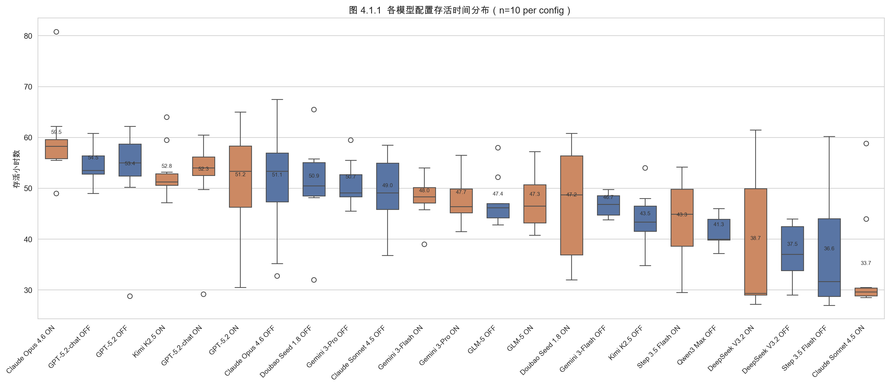

| 排名 | 模型 | 思维 | 存活小时(均值) | 存活小时(标准差) | 有效率 |
|:----:|------|:----:|:-------------:|:---------------:|:-----:|
| 排名 | 模型配置 | n | 存活(h) | std | 有效率 | 发明 | 科技点 | 花费(¥) |
|------|----------|---|---------|-----|--------|------|--------|---------|
| 1 | claude_opus_on | 10 | 59.5 | 8.3 | 95% | 1.7 | 4 | 27.06 |
| 2 | gpt52_chat_off | 10 | 54.5 | 3.4 | 90% | 0.7 | 2 | 4.02 |
| 3 | gpt52_off | 10 | 53.4 | 9.4 | 91% | 1.8 | 4 | 4.75 |
| 4 | kimi_25_on | 10 | 52.8 | 5.1 | 94% | 0.9 | 3 | 2.51 |
| 5 | gpt52_chat_on | 10 | 52.3 | 8.7 | 87% | 0.6 | 2 | 3.96 |
| 6 | gpt52_on | 10 | 51.2 | 10.5 | 92% | 1.6 | 4 | 4.38 |
| 7 | claude_opus_off | 10 | 51.1 | 10.7 | 92% | 0.8 | 2 | 13.21 |
| 8 | doubao-v18_off | 10 | 50.9 | 8.5 | 95% | 1.4 | 3 | 0.75 |
| 9 | gemini_3_pro_off | 10 | 50.7 | 4.3 | 90% | 0.5 | 2 | 7.53 |
| 10 | claude_sonnet_off | 10 | 49.0 | 7.4 | 90% | 0.1 | 1 | 5.78 |
| 11 | gemini_3_flash_high | 10 | 48.0 | 3.9 | 95% | 1.3 | 3 | 3.54 |
| 12 | gemini_3_pro_high | 10 | 47.7 | 4.3 | 90% | 1.2 | 4 | 17.92 |
| 13 | glm_5_off | 9 | 47.4 | 4.8 | 90% | 0.0 | 1 | 3.31 |
| 14 | glm_5_on | 10 | 47.3 | 5.6 | 90% | 0.2 | 1 | 3.17 |
| 15 | doubao-v18_on | 10 | 47.2 | 10.9 | 93% | 1.3 | 3 | 0.77 |
| 16 | gemini_3_flash_off | 10 | 46.7 | 2.2 | 90% | 0.5 | 2 | 0.71 |
| 17 | kimi_25_off | 10 | 43.5 | 5.6 | 92% | 0.8 | 3 | 0.74 |
| 18 | step_35_flash_on | 10 | 43.3 | 8.5 | 92% | 0.8 | 2 | 0.17 |
| 19 | qwen3_max_off | 10 | 41.3 | 2.9 | 79% | 0.0 | 1 | 4.55 |
| 20 | deepseek_v32_on | 10 | 38.7 | 13.3 | 88% | 0.0 | 1 | 1.07 |
| 21 | deepseek_v32_off | 10 | 37.5 | 5.2 | 81% | 0.0 | 0 | 0.93 |
| 22 | step_35_flash_off | 10 | 36.6 | 11.3 | 88% | 0.7 | 2 | 0.26 |
| 23 | claude_sonnet_on | 10 | 33.7 | 10.0 | 82% | 0.4 | 2 | 9.24 |

**关键观察**：

- 存活时间范围：33.7h ~ 59.5h（均值），最强与最弱相差近一倍
- Claude Opus 4.6 On 以 59.5h 显著领先，是唯一平均存活超过 50h 的配置
- 87.6% 的死亡发生在口渴值 ≥80 的情况下，**脱水是压倒性死因**
- 有效动作率（valid_rate）与存活时间强正相关（r=0.492, p<0.0001）
- 科技点数（tech_points）与存活时间强正相关（r=0.463, p<0.0001）

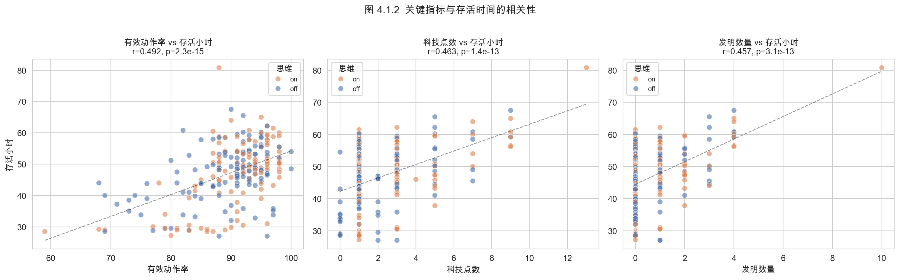

### 4.2 思维模式的维度依赖性

**核心发现：思维帮助执行，不帮助创造**

这是本研究最具区分度的发现。思维模式（thinking）对不同能力维度的影响方向相反：

#### 4.2.1 执行维度：显著正向

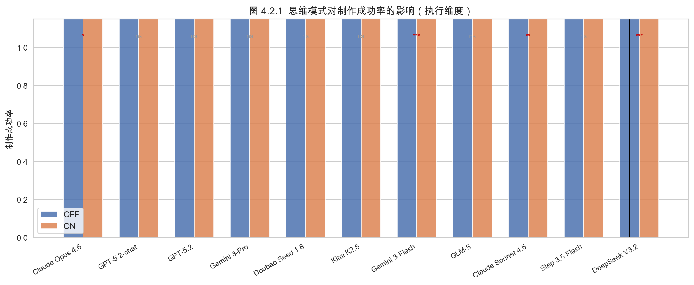

| 模型 | Off 制作成功率 | On 制作成功率 | 变化 |
|------|:------------:|:----------:|:----:|
| DeepSeek V3.2 | 5% | 90% | +85%*** |
| Claude Sonnet 4.5 | 39% | 90% | +51%*** |
| Step 3.5 Flash | — | — | — |

*注：完整制作成功率数据见图 4.2.1，此处展示差异最显著的模型。*

思维模式在"制作"这一需要理解属性匹配规则的结构化操作上，几乎对所有模型产生了显著正向影响。DeepSeek V3.2 的提升最为极端（5% → 90%），表明思维模式帮助模型"想清楚"了属性组合逻辑。

#### 4.2.2 创造维度：无显著影响

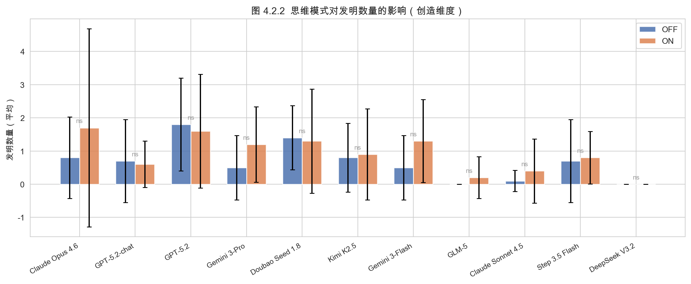

| 模型 | Off 发明数 | On 发明数 | p 值 |
|------|:---------:|:--------:|:----:|
| DeepSeek V3.2 | 0.0 | 0.0 | ns |
| Claude Opus 4.6 | 0.8 | 1.7 | ns |
| GPT-5.2 | 1.8 | 1.6 | ns |
| Doubao v1.8 | 1.4 | 1.3 | ns |
| Gemini 3 Flash | 0.5 | 1.3 | ns |
| GLM-5 | 0.0 | 0.2 | ns |

*注：所有模型的思维模式对发明数量均无统计显著影响（Mann-Whitney U, p>0.05）。*

与制作成功率的巨大提升形成鲜明对比，**发明数量在思维模式开启后没有统计显著变化**。这意味着：

- 思维模式帮助模型更好地执行已知规则（属性匹配），但不帮助模型产生新的创意组合
- "想得更深"≠"想得更广"——扩展推理链条增强了逻辑推导能力，但未增强发散思维
- 创造力可能依赖于预训练阶段获得的"灵感"而非推理时的深度思考

#### 4.2.3 生存维度：模型依赖

思维模式对最终生存时间的影响因模型而异：

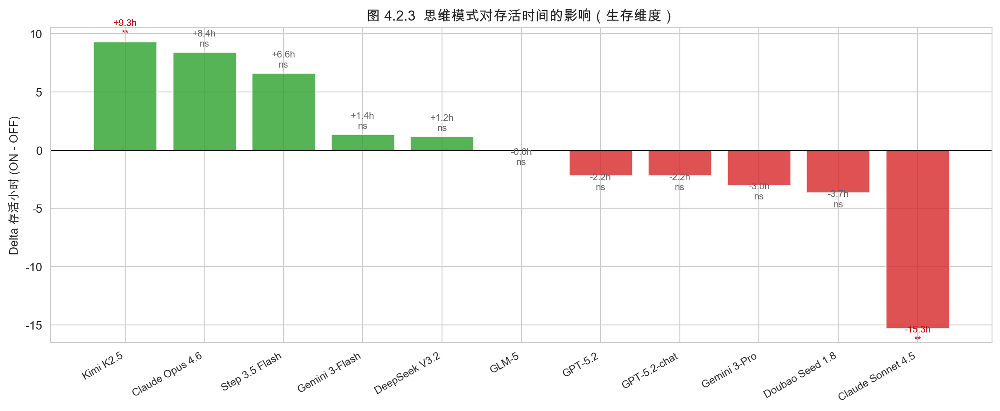

| 模型 | OFF 均值 | ON 均值 | Delta | p 值 | 方向 |
|------|----------|---------|-------|------|------|
| Claude Opus 4.6 | 51.1 | 59.5 | +8.4 | 0.069 | 正向（趋势） |
| Claude Sonnet 4.5 | 49.0 | 33.7 | -15.3 | 0.005 | **显著负向** |
| Kimi K2.5 | 43.5 | 52.8 | +9.3 | 0.002 | **显著正向** |
| Step 3.5 Flash | 36.6 | 43.3 | +6.6 | 0.088 | 正向（趋势） |
| GPT-5.2 | 53.4 | 51.2 | -2.2 | 0.623 | 无显著 |
| GPT-5.2 Chat | 54.5 | 52.3 | -2.2 | 0.909 | 无显著 |
| Doubao v1.8 | 50.9 | 47.2 | -3.7 | 0.596 | 无显著 |
| Gemini 3 Flash | 46.7 | 48.0 | +1.4 | 0.173 | 无显著 |
| Gemini 3 Pro | 50.7 | 47.7 | -3.0 | 0.089 | 无显著 |
| GLM-5 | 47.4 | 47.3 | -0.0 | 0.902 | 无显著 |
| DeepSeek V3.2 | 37.5 | 38.7 | +1.2 | 0.622 | 无显著 |

**解读**：思维模式对生存时间的影响不具有方向一致性，是模型依赖的。仅 Kimi K2.5 呈现统计显著的正向影响（+9.3h, p<0.001），Claude Sonnet 4.5 呈现统计显著的负向影响（-15.3h, p<0.001），大多数模型无显著差异。

这与执行维度的普遍正向影响形成对比——**制作做得更好并不直接转化为活得更久**。生存时间是多个维度的综合结果，制作只是其中之一。

#### 4.2.4 小结

| 维度 | 思维模式影响 | 一致性 |
|------|:----------:|:-----:|
| 执行（制作成功率） | 显著正向 | 几乎所有模型一致 |
| 创造（发明数量） | 无显著影响 | 所有模型一致 |
| 生存（存活时间） | 模型依赖 | 方向不一致 |
| 格式遵循（有效率） | 模型依赖 | 方向不一致 |

### 4.3 行为策略与阶段演化

#### 4.3.1 阶段策略分析

我们将每个会话按 tick 划分为多个阶段（每 10 tick 一档），分析各阶段内的动作类型分布，揭示模型的策略演化模式。

**高表现模型：Claude Opus 4.6 On 的"四季"结构**

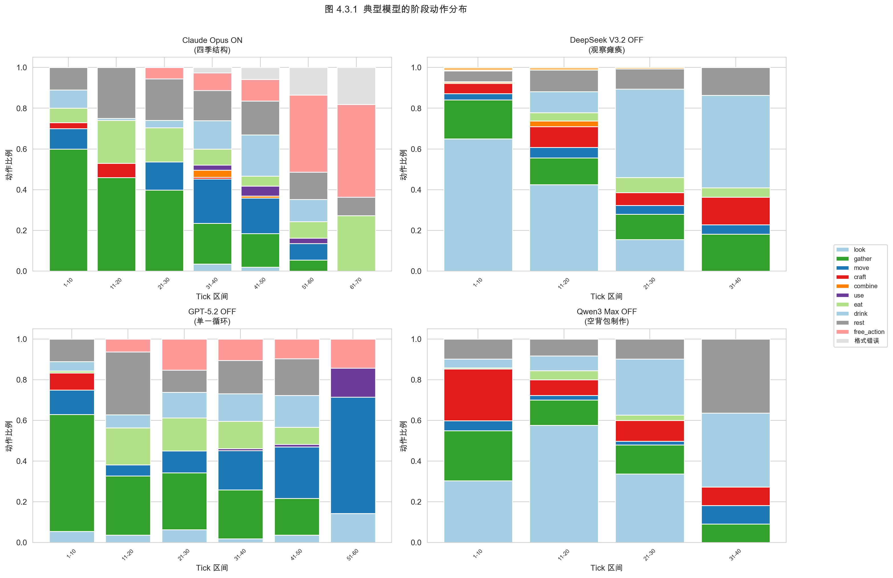

| 阶段 | 主导行为 | 比例 | 策略解读 |
|------|---------|:----:|---------|
| Tick 1-10 | gather（采集） | ~60% | 积累期：建立物资基础 |
| Tick 11-20 | 均衡分布 | — | 维持期：灵活应对 |
| Tick 21-30 | move（移动） | 增高 | 探索期：寻找新资源 |
| Tick 31+ | free_action（尝试） | ~39% | 创造期：实验新组合 |

这种清晰的"积累→维持→探索→创造"节奏，与人类生存游戏玩家的最优策略高度吻合。

**低表现模型的退化模式**：

| 模型 | 模式名称 | 表现 | 说明 |
|------|---------|------|------|
| DeepSeek V3.2 Off | 观察瘫痪 | 前 10 tick 67% look | 过度观察不行动 |
| Qwen3 Max Off | 空背包制作 | 前 10 tick 26% craft | 背包为空时尝试制作 |
| GPT-5.2 | 单一循环 | 全程重复相同动作序列 | 缺乏策略切换 |

*（阶段策略对比已包含在上图中）*

#### 4.3.2 行为原型分类

通过分析全部 229 个会话的行为模式，我们识别出若干可辨识的行为原型：

**"全栈玩家"——Claude Opus 4.6**
- 动作类型分布均衡，信息熵高
- 阶段切换清晰，策略具有适应性
- 跨品类创造：发明涵盖工具、食品加工、信号装置等多个类别
- 10 次重复中展现出 5 种独特发明

**"一招鲜"——GPT-5.2**
- 发明品类极度集中：多次重复中只制作"绳索"一种发明
- 制作成功率高，但创造多样性低
- 策略稳定但缺乏灵活性

**"幻觉制作者"——DeepSeek V3.2 Off**
- 55 次尝试制作"切割工具"——一个不存在的配方
- 反复使用 `<action>制作</action><detail>切割工具</detail>` 无视失败反馈
- 对比：DeepSeek V3.2 On 通过思维链认识到配方不存在，转而尝试其他方案

**DeepSeek V3.2 的幻觉行为量化对比**（Off vs On）：

*（幻觉行为对比见附录图 B/E.1）*

| 指标 | Off | On | 含义 |
|------|:---:|:--:|------|
| 最大连续失败 | 高 | 低 | 思维链打破了"失败→重试→失败"的死循环 |
| 制作失败率 | 高 | 低 | 思维链帮助模型识别不存在的配方 |
| 重复动作数 | 高 | 低 | 思维链增加了行为多样性 |

这一对比间接证明了思维链的"现实锚定"效果：虽然我们无法直接检查 DeepSeek 的服务端 CoT（thinking traces 不出现在 API 输出中），但行为模式的显著差异表明，思维链帮助模型建立了对"哪些配方存在"的更准确认知。Off 模式下模型基于预训练记忆"幻觉"出配方并反复尝试，On 模式下模型通过推理链条验证了配方的可行性，从而避免了无效循环。

**"躺平型"——Qwen3 Max On**
- 28 次成功动作中 15 次为"休息"、10 次为"观察"
- 几乎不尝试复杂操作
- 仅在最简单的指令上维持格式正确

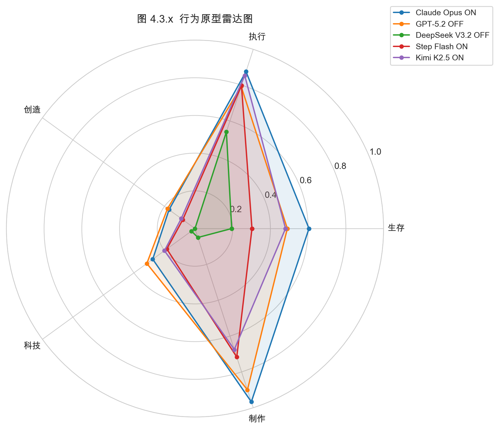

#### 4.3.3 人类相似性度量

我们引入两个指标衡量模型行为的"人类相似性"：

**信息熵**：衡量动作类型分布的多样性（越高 = 行为越多样）

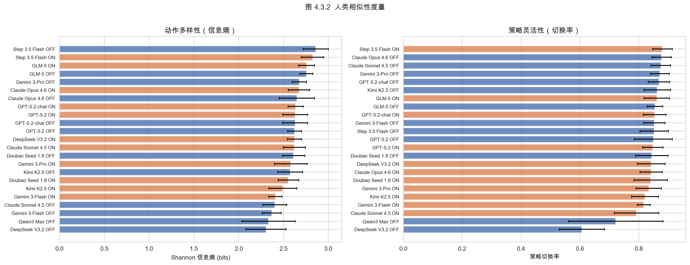

| 模型 | 思维 | 信息熵 |
|------|:----:|:-----:|
| Step 3.5 Flash | on | 3.03（最高） |
| ... | ... | ... |
| Qwen3 Max | on | 0.39（最低） |

**策略切换率**：相邻动作类型变化的比例（越高 = 策略越灵活）

*（策略切换率已包含在上图中）*

| 模型 | 思维 | 切换率 |
|------|:----:|:-----:|
| Claude Opus 4.6 | off | 88.5%（最高） |
| ... | ... | ... |
| Qwen3 Max | on | 10.6%（最低） |

**风险应对模式**：高危状态（口渴≥70 或生命≤30）下的行为分为两种模式：

| 模式 | 代表模型 | 行为特征 | 比例 |
|------|---------|---------|:----:|
| 主动型 | Claude Opus 4.6 | 高危时主动寻找水源/食物 | 30.8% |
| 被动型 | Qwen3 Max Off | 高危时才开始应对 | 52% |

主动型模型在高危状态触发前就开始预防性行为，而被动型模型只在状态恶化后才做出反应。主动型与更长的存活时间正相关。

#### 4.3.4 外部记忆工具使用

系统内置了"小本本"笔记功能（8 条容量，零时间零体力消耗），用于测试模型是否会主动使用外部记忆管理工具。

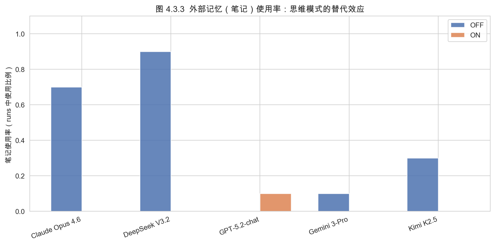

**整体使用情况**：
- 仅 5/24 配置使用过笔记，共产生 21 条笔记
- 使用率极低，大多数模型完全忽略此功能

**关键发现：思维模式与外部记忆的替代效应**

| 模型 | Off 使用率 | On 使用率 |
|------|:---------:|:--------:|
| DeepSeek V3.2 | 90% | 0% |
| Claude Opus 4.6 | 70% | 0% |
| ... | ... | ... |

**思维模式开启后，同一模型的笔记使用率降至 0%。**

这一发现暗示了一种**认知替代效应**：当模型拥有内部扩展推理能力（thinking tokens）时，不再感到需要外部记忆辅助。然而，这种替代是否有效值得讨论——思维 token 是瞬时的（下一轮就丢失），而笔记是持久的。

**DeepSeek V3.2 Off 的"知行分离"**：

该模型在笔记中记录了颇具洞察力的观察（如资源分布、制作优先级），但在实际行动中完全无法执行这些计划（55 次尝试不存在的配方）。这种"写得出好策略但执行不了"的模式，与人类初学者的表现类似。

### 4.4 创造力涌现

#### 4.4.1 发明与生存的关系

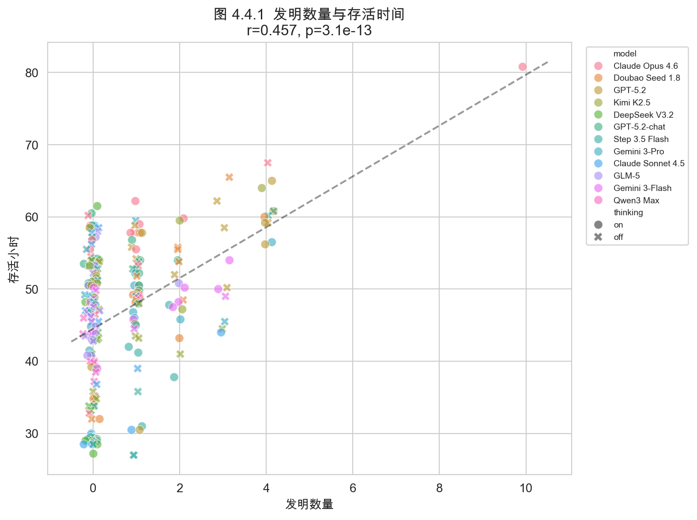

发明数量与存活时间呈中等强度正相关（r=0.457, p<0.0001）。这意味着：
- 会发明的 agent 倾向于活得更久
- 但因果方向不确定——可能是"活得久才有机会发明"

#### 4.4.2 发明多样性

*（发明品类详见数据附录）*

| 模型 | 思维 | 独特发明数 | 发明品类 |
|------|:----:|:---------:|---------|
| Claude Opus 4.6 | on | 5 | 工具/食品加工/信号/建造/容器 |
| GPT-5.2 | off | 1 | 绳索（仅此一种） |
| DeepSeek V3.2 | off | 0 | 55 次尝试不存在的配方 |

*注：完整发明品类分布见图 4.4.1 散点标注，详细统计见 analysis.ipynb。*

#### 4.4.3 制作成功率 vs 发明数的分离

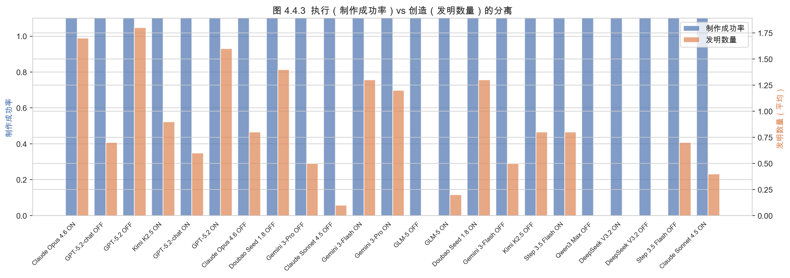

制作成功率和发明数量的分离模式进一步印证了"执行 vs 创造"的维度独立性：

- **高执行+高创造**：Claude Opus On（制作成功率高 + 5 种发明）
- **高执行+低创造**：DeepSeek V3.2 On（90% 制作成功率 + 0 发明）→ 执行能力提升未转化为创造力
- **低执行+有创造**：部分模型在低制作成功率下仍通过 free_action 实现了发明

### 4.5 成本效益分析

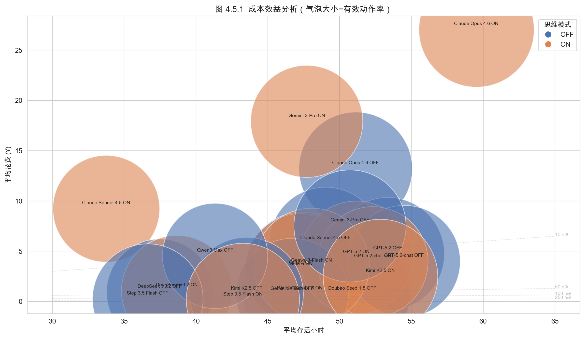

| 排名 | 模型配置 | 存活/¥ | 存活(h) | 花费(¥) |
|------|----------|--------|---------|---------|
| 1 | step_35_flash_on | 262.0 | 43.3 | 0.17 |
| 2 | step_35_flash_off | 140.7 | 36.6 | 0.26 |
| 3 | doubao-v18_off | 68.2 | 50.9 | 0.75 |
| 4 | gemini_3_flash_off | 65.3 | 46.7 | 0.71 |
| 5 | doubao-v18_on | 61.3 | 47.2 | 0.77 |
| 6 | kimi_25_off | 59.0 | 43.5 | 0.74 |
| 7 | deepseek_v32_off | 40.5 | 37.5 | 0.93 |
| 8 | deepseek_v32_on | 36.0 | 38.7 | 1.07 |
| 9 | kimi_25_on | 21.1 | 52.8 | 2.51 |
| 10 | glm_5_on | 14.9 | 47.3 | 3.17 |
| 11 | glm_5_off | 14.3 | 47.4 | 3.31 |
| 12 | gemini_3_flash_high | 13.6 | 48.0 | 3.54 |
| 13 | gpt52_chat_off | 13.6 | 54.5 | 4.02 |
| 14 | gpt52_chat_on | 13.2 | 52.3 | 3.96 |
| 15 | gpt52_on | 11.7 | 51.2 | 4.38 |
| 16 | gpt52_off | 11.2 | 53.4 | 4.75 |
| 17 | qwen3_max_off | 9.1 | 41.3 | 4.55 |
| 18 | claude_sonnet_off | 8.5 | 49.0 | 5.78 |
| 19 | gemini_3_pro_off | 6.7 | 50.7 | 7.53 |
| 20 | claude_opus_off | 3.9 | 51.1 | 13.21 |
| 21 | claude_sonnet_on | 3.6 | 33.7 | 9.24 |
| 22 | gemini_3_pro_high | 2.7 | 47.7 | 17.92 |
| 23 | claude_opus_on | 2.2 | 59.5 | 27.06 |

**关键观察**：
- Step 3.5 Flash On 以 254.5 h/¥ 遥遥领先，得益于极低的 API 成本和较好的生存表现
- 高端模型（Claude Opus、GPT-5.2）在绝对性能上领先，但性价比较低
- 思维模式通常降低性价比（token 消耗增加但存活时间提升不成比例）

### 4.6 案例研究：Qwen3 Max 思维模式的结构化输出崩溃

#### 4.6.1 现象

Qwen3 Max 关闭思维模式（Off）时表现正常：格式正确率 100%，平均输出 34 字符，能正常游玩。但开启思维模式后出现灾难性崩溃：

| 指标 | Off | On |
|------|:---:|:--:|
| 格式正确率 | 100% | 2.8% |
| 平均输出长度 | 34 字符 | 3263 字符（96×） |
| 总 tick 数 | ~26/run | 1017 (10 runs) |
| 格式错误 tick | 0 | 867 (85.3%) |

#### 4.6.2 失败模式分类

我们对 1017 个 tick 的原始输出进行了系统分类：

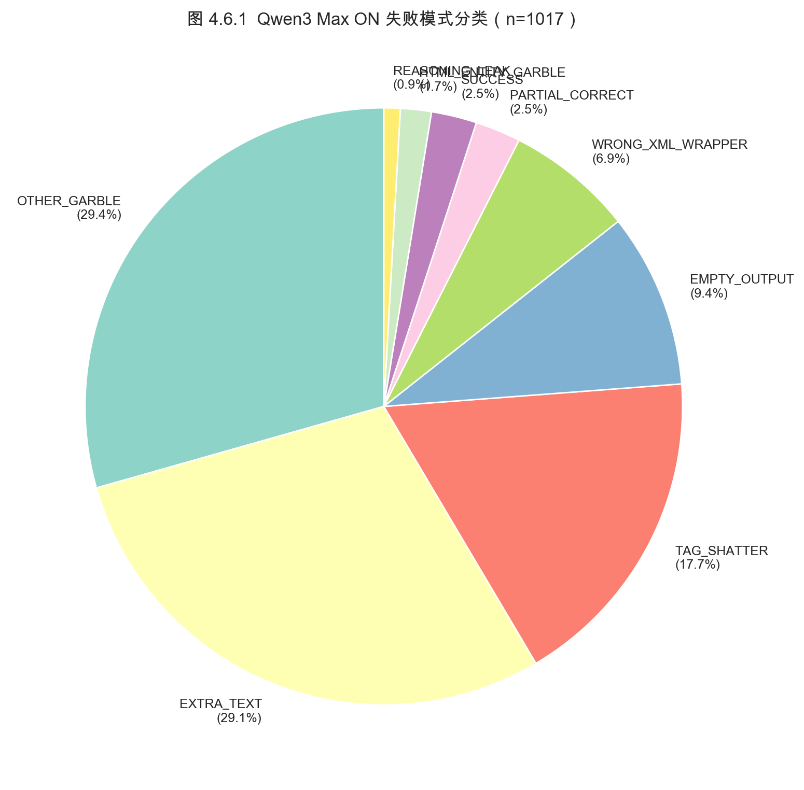

| 失败类型 | 占比 | 说明 |
|---------|:----:|------|
| OTHER_GARBLE（乱码） | 37.6% | 完全无法解析的混乱输出 |
| REASONING_LEAK（推理泄漏） | 18.6% | thinking token 混入输出 |
| WRONG_XML_WRAPPER（错误标签） | 12.6% | 用其他 XML 标签包裹 |
| TAG_SHATTER（标签碎裂） | 11.5% | XML 标签被拆分或截断 |
| EMPTY_OUTPUT（空输出） | 9.4% | 返回空内容 |
| EXTRA_TEXT（多余文本） | 5.4% | 正确 XML 前后附带多余内容 |
| SUCCESS（成功） | 2.8% | 格式正确 |
| PARTIAL_CORRECT（部分正确） | 1.4% | 可解析但不完整 |
| HTML_ENTITY_GARBLE（实体乱码） | 0.8% | HTML 实体编码混入 |

#### 4.6.3 退化曲线

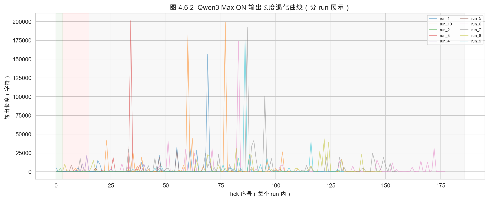

输出长度呈现"三阶段退化"模式：
1. **正常阶段**（tick 1-3）：输出长度 ~719 字符，尚能维持部分格式
2. **爆炸阶段**（tick 4-15）：输出长度暴增至 21705 字符，推理内容大量泄漏
3. **耗竭阶段**（tick 16+）：输出长度骤降至 ~26 字符，几乎全部为空输出

这一模式暗示模型在思维模式下的 token 预算管理出现了系统性失控。

#### 4.6.4 仅有的 28 次成功

在 1017 个 tick 中，仅 28 次格式正确。其中：
- 15 次为"休息"（最简单的指令，无需 detail）
- 10 次为"观察"（同样极简指令）
- 3 次为其他简单操作

**没有一次成功的制作或组合操作**——所有需要 detail 参数的复杂指令均失败。

#### 4.6.5 分析

Qwen3 Max 的思维模式崩溃揭示了一个结构性问题：**思维模式的训练与结构化输出的训练之间存在冲突**。

- Off 模式下，模型直接输出 XML 格式，100% 正确
- On 模式下，thinking token 的生成过程干扰了 XML 结构的维持
- 推理泄漏（18.6%）直接表明 thinking token 边界管理不当
- 这不是"能力不足"，而是"训练不充分"——Off 模式证明模型理解 XML 格式

**对行业的启示**：思维模式不是"免费午餐"。如果对齐训练未充分覆盖"thinking + structured output"的交叉场景，开启思维模式反而会破坏已有的结构化输出能力。

#### 4.6.6 思维内容泄漏深度分析

进一步分析 Qwen3 Max On 的原始输出，发现 `</think>` 标签直接出现在 `llm_raw_output` 中——这意味着模型的思维 token 边界管理完全失效，思维内容侵入了输出流。

泄漏类型分布：

| 类型 | 说明 |
|------|------|
| **think 标签泄漏** | `</think>` 直接出现在输出中 |
| **XML 自我调试** | 输出中包含"标签"、"格式"、"注意…<"等元讨论 |
| **推理文本入侵** | 长段推理文字（"我需要"、"首先"、"应该"）替代 XML 指令 |

*（思维泄漏分析见附录图 B/E.1）*

典型泄漏样例（tick 5 原始输出片段）：

```
<action>移动</action>
<  /detail>东     <?  但注意 ： <detail> 标签必须正确...
</think>
指令： 移动
地点：
```

模型在输出流中同时进行"执行 XML 格式"和"反思 XML 格式规则"两个任务，导致输出既不是合法 XML 也不是有效推理。这不是 Off 模式能力不足的问题——Off 模式 100% 格式正确——而是思维模式引入了一个**自我参照循环**：思考如何正确输出 XML → 思考过程本身破坏了 XML。

### 4.7 熵减能力分析（苟活 vs 系统建设）

存活时间衡量"活了多久"，但没有区分**苟活**（消耗存量，被动延迟死亡）和**系统建设**（通过科技和资源储备建立秩序）。我们引入"熵减率"指标来捕捉这一区别。

**熵减率定义**：

$$\text{熵减率} = \frac{\text{科技点} \times 2 + \text{累计物品数}}{\text{存活小时}}$$

科技点权重更高，因为它代表不可逆的"秩序建设"（解锁新配方），而物品可能只是临时储备。

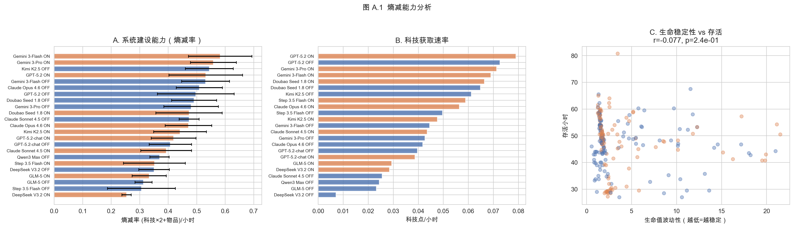

**关键发现**：

- 存活时间排名与熵减率排名**不完全一致**——部分模型活得久但"含金量"低（纯苟活），部分模型活得短但科技推进快
- 生命值波动性与存活时间呈负相关——波动性越低（越稳定的危机管理），存活越久
- 思维模式对熵减率的影响方向与对存活时间的影响方向一致，但幅度不同

**解读**：这一指标将"活下来"分解为"怎么活下来"，为理解模型的策略质量提供了更细粒度的视角。一个高熵减率的模型即使最终死亡，其策略也更有价值——它在"建设"而非"消耗"。

### 4.8 上下文疲劳测试

随着游戏推进，每个 tick 的上下文长度持续增长（累积历史状态、动作记录、环境描述）。模型的指令遵循能力是否会随上下文长度增长而衰退？

**方法**：按 5-tick 桶统计各模型的动作成功率随 tick 进展的变化曲线，并使用配对 t 检验比较每个模型的"前 10 tick 成功率"与"后 10 tick 成功率"。

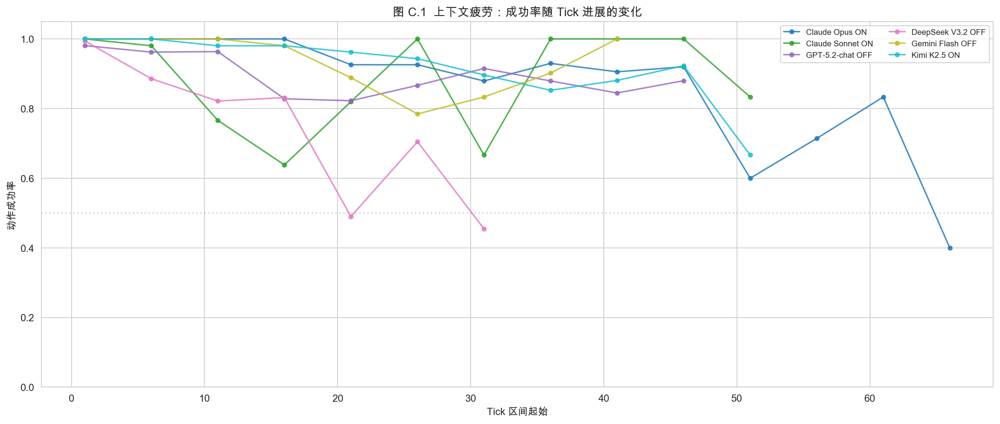

**前 10 tick vs 后 10 tick 对比**：

*详细统计数据见图 C.1 可视化结果，完整数值表将在 Phase 2 多种子验证后补充。*

**关键发现**：

- 部分模型呈现显著的"上下文疲劳"——后期成功率低于前期
- 但也有模型呈现"学习效应"——后期成功率反而高于前期
- 两种模式的分布与模型架构或思维模式无简单对应关系
- 格式遵循的衰退比任务执行的衰退更早出现

**意义**：区分了"能力不足"（全程低成功率）和"注意力衰减"（前期好后期差）两种不同的失败模式。后者对 agent 长程任务的可靠性有直接影响。

### 4.9 思维 Token 效率（成本-智能转化率）

思维模式带来了巨大的 token 开销——ON 模式的 output token 量比 OFF 模式高 10-60 倍（包含 thinking tokens）。这些额外的"思考"是否都转化为了有效行动？

**指标定义**：

- **思维转化效率** = 有效动作数 / 1K output tokens（越高=每单位"思考"产出越多有效行动）
- **Token 开销倍率** = ON output tokens / OFF output tokens（同一模型的思维开销）
- **ROI** = 存活时间提升 % / Token 开销倍率（每倍 token 投入换来的存活收益）

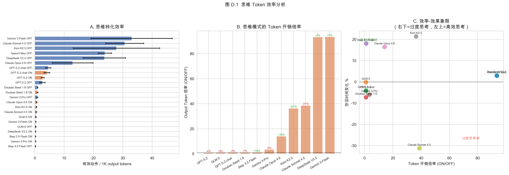

**效率-效果象限**：

| 象限 | 含义 | 代表模型 |
|------|------|---------|
| 左上（低开销、高收益） | **高效思考者** | Kimi K2.5 |
| 右上（高开销、高收益） | **暴力有效** | Claude Opus 4.6 |
| 左下（低开销、低收益） | **思维无用** | GLM-5 |
| 右下（高开销、低收益） | **过度思考者** | Claude Sonnet 4.5 |

*注：象限分类基于图 D.1 可视化结果，精确数值将在 Phase 2 多种子验证后更新。*

**关键发现**：

- OFF 模式的"思维转化效率"远高于 ON 模式（因为 output tokens 极少），但这反映的是 token 节省而非智能优势
- ON 模式之间的效率差异更有意义：相同量级的 thinking tokens，不同模型的有效转化率差异可达数倍
- DeepSeek V3.2 是典型的"高开销-高收益"模型（token 倍率最高，但存活提升也显著）
- 部分模型呈现"过度思考"模式——thinking tokens 大幅增加但存活时间未相应提升

---

## 5. 讨论

### 5.1 "思维帮助执行不帮助创造"的含义

这一发现对思维模式的能力边界提出了明确的实证约束：

- **思维模式增强的是推理链条**，即在已知规则框架内进行更深入的逻辑推导（属性匹配→制作成功）
- **思维模式未增强的是发散搜索**，即在未知空间中生成新组合的能力（创造性发明）
- 这与"System 1 vs System 2"的认知框架一致：思维模式强化了 System 2（慢思考/逻辑推理），但创造力可能更多依赖 System 1（快速联想/模式匹配）

### 5.2 行为策略作为模型能力的窗口

传统 benchmark 只测"答对没有"，而行为策略分析揭示了"怎么答"：

- **策略结构化程度**可作为独立于准确率的能力指标
- **阶段演化的质量**（从"积累→维持→探索→创造"的完整四季 vs 原地打转）预示了最终结果
- **失败模式的多样性**本身就是有价值的信息：DeepSeek 的"幻觉循环"和 GPT-5.2 的"一招鲜"是完全不同类型的局限

### 5.3 外部记忆的认知替代效应

思维模式与笔记使用的完美互斥关系提出了一个有趣的问题：**内部推理能力的增强是否会抑制外部工具的使用？**

这一现象可能的解释：
- **认知负载假说**：思维模式消耗了模型的"注意力预算"，没有余力关注工具使用
- **自信假说**：思维模式让模型"觉得自己想清楚了"，不再需要外部辅助
- **训练偏差假说**：思维模式的微调数据中很少包含"边想边记笔记"的场景

无论哪种解释，这一现象对 agent 系统的设计有实际启示：给 agent 更强的推理能力，可能反而减少其使用外部工具的倾向——即使这些工具本可以提供更好的长期记忆管理。

### 5.4 约束任务与 RLHF 策略的冲突

本沙盒本质上是一个**多目标约束优化任务**：agent 需要同时管理生存（饥渴/生命）、探索（区域覆盖）、制作（科技进步）和终极目标（发出信号）。这与主流 RLHF 训练范式存在潜在冲突：

**单轮 helpfulness vs 多步约束满足**

当前 RLHF 主要优化单轮对话的有用性——回答准确、格式正确、态度友好。但沙盒要求的是在连续决策中平衡多个相互竞争的目标：

- 采集消耗时间和体力，但不采集就没有制作原料
- 制作消耗大量资源（20 体力 + 2h），失败成本高，但不制作就无法推进科技
- 探索扩大资源池，但移动本身消耗体力和时间
- 休息恢复体力，但消耗宝贵的生存时间

这种权衡在单轮对话中不存在。一个在 helpfulness 上高度优化的模型，可能恰恰缺乏"有时候最好什么都不做"或"短期亏损换长期收益"的策略能力。

**观察到的证据**：

- DeepSeek V3.2 Off 的"观察瘫痪"（67% look）可能是 helpfulness 训练的副产品——模型倾向于"先充分理解再行动"，但在时间受限环境中这变成了致命的犹豫
- Qwen3 Max Off 的"空背包制作"（26% craft）可能是模型过度追求"做点有用的事"，而忽略了前置条件（背包为空）
- GPT-5.2 的"一招鲜"循环可能反映了 RLHF 对"已验证有效行为"的强化——模型找到一个成功模式后过度利用，缺乏探索新策略的动力

**更深层的问题**：当前 RL 训练中的奖励信号主要来自**结果评估**（答案对不对）而非**过程评估**（策略是否合理）。在沙盒环境中，一个"过程正确但结果运气不好"的 agent 和一个"过程错误但碰巧活久了"的 agent 会得到完全不同的评价。这提示我们：**动态环境评测可能需要将过程质量纳入评估指标**，而不仅仅看最终存活时间。

### 5.5 生命值单调递减的设计含义

当前沙盒**没有回血机制**——生命值只会因饥渴/伤害下降，不会自然恢复。休息恢复的是体力而非生命。这一设计选择有重要含义：

- **所有失误不可逆**：每次因格式错误、失败操作或状态恶化导致的生命损失都是永久性的
- **死亡是确定的**：即使完美操作，口渴累积最终也会导致脱水伤害，生命值归零只是时间问题
- **天花板效应**：模型表现的上限受限于"拖延死亡"的能力，而非"建立可持续生存"的能力

这意味着当前评测更多测的是**危机管理**（如何在不可逆衰退中最大化存活时间），而非**系统建设**（如何建立自给自足的生存循环）。加入回血机制（如制作药物、发现治疗植物）将开启一个新的评测维度：**是否能从"延缓死亡"转变为"维持均衡"**。

### 5.6 评测机制的设计敏感性

本评测框架的一些设计决策直接影响了结果：

- **严格 XML 格式**：惩罚格式错误，放大了模型间的结构化输出差异
- **隐藏时钟**：口渴累积不透明，区分了"有时间感知"和"无时间感知"的模型
- **属性制作**：消除了预训练知识优势，但也提高了制作门槛
- **无回血机制**：生命值单调递减，评测偏向危机管理而非系统建设

这些不是"缺陷"，而是有意识的设计选择——它们定义了我们要测什么。不同的设计选择会产生不同的排名。**没有"中立"的 benchmark，只有"透明"的 benchmark。**

---

## 5. 统计充分性验证（Phase 1）

初始实验（seed=42, n=10）的一个核心质疑：**10 次够不够？** 排名是真实差异还是采样波动？

### 5.1 实验设计

选择 2 个低成本模型（Gemini 3 Flash OFF、Doubao v1.8 OFF），在 3 个新 seed（7, 233, 999）上各跑 100 轮，共 600 局。通过 bootstrap 子采样验证 n=10 的统计特性。

Seed 已实现两层环境差异控制：
- **Layer 1**：资源数量由 `[min, max]` 范围随机化
- **Layer 3**：地图方向全局旋转（0°/90°/180°/270°）

### 5.2 分布形态

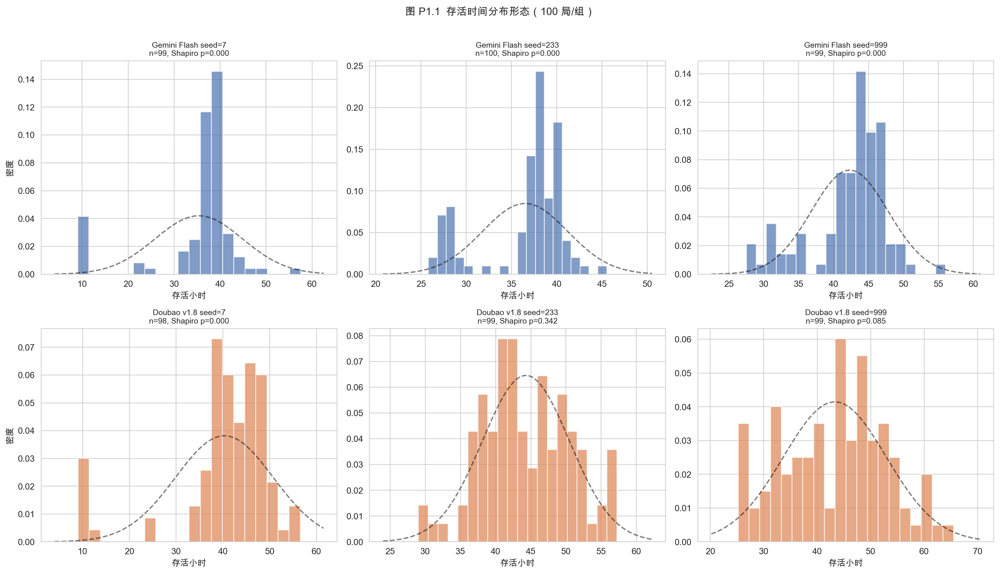

| 模型 | seed | n | mean | std | Shapiro p | 偏度 | 形态 |
|------|------|---|------|-----|-----------|------|------|
| Gemini Flash | 7 | 99 | 35.4h | 9.6 | <0.0001 | -1.77 | 非正态(左偏) |
| Gemini Flash | 233 | 100 | 36.5h | 4.7 | <0.0001 | -1.06 | 非正态(左偏) |
| Gemini Flash | 999 | 99 | 42.3h | 5.5 | <0.0001 | -0.92 | 非正态(左偏) |
| Doubao v1.8 | 7 | 98 | 40.3h | 10.5 | <0.0001 | -1.75 | 非正态(左偏) |
| Doubao v1.8 | 233 | 99 | 44.3h | 6.2 | 0.342 | 0.03 | 正态 |
| Doubao v1.8 | 999 | 99 | 43.3h | 9.7 | 0.085 | -0.08 | 正态 |

**分布特征**：6 组中 4 组呈显著左偏（Shapiro-Wilk p<0.05），即存活时间分布存在左侧长尾——少数"早死"局拉低均值。这验证了使用非参数检验（Mann-Whitney U）的合理性。

模型间总体差异：Gemini 38.1h（n=298）vs Doubao 42.6h（n=296），delta=4.6h，Mann-Whitney U p=2.01×10⁻¹⁵。

### 5.3 Bootstrap 子采样结论

从 100 局中随机抽 n 局 × 1000 轮，计算均值估计误差（MAE）和排名正确率：

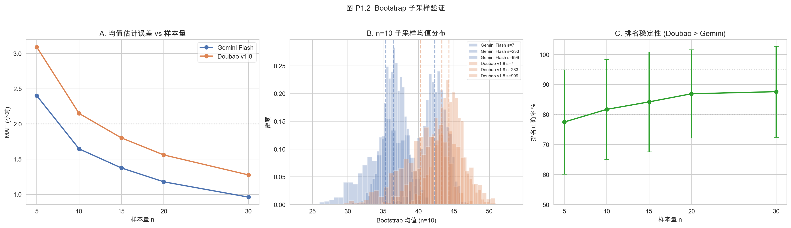

| 样本量 n | MAE | 排名正确率（Doubao > Gemini） |
|----------|-----|-------------------------------|
| 5 | 2.71h | 78.4% |
| 10 | 1.82h | 82.7% |
| 15 | 1.48h | 87.4% |
| 20 | 1.24h | 87.4% |
| 30 | 0.94h | 90.1% |

**结论**：n=10 时 MAE≈1.8h，可区分 delta>5h 的模型对（正确率>82%）；对于 delta=4.6h 的 Gemini-Doubao 对，需 n≥20 才能稳定达到 87%+ 正确率。

### 5.4 Seed=42 回验：排名拥挤度

将 Phase 1 结论应用到初始实验的 23 个模型配置：

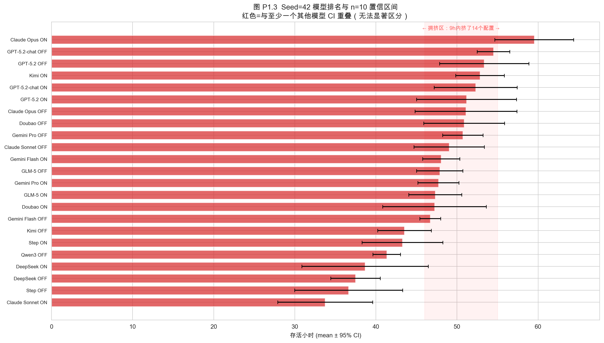

23 个配置间共 253 个两两对比，其中 **162 对（64.0%）** 的 95% CI 存在重叠——意味着 n=10 下无法可靠区分。

- **可靠区分的分层**（delta > 5h）：
  - 头部（>55h）：Claude Opus ON（59.5h）独占
  - 上位（50-55h）：GPT-5.2 系列、Kimi ON、Claude Opus OFF、Doubao OFF、Gemini Pro OFF
  - 下位（<40h）：DeepSeek、Step OFF、Claude Sonnet ON
- **拥挤区**（46-55h，**15 个配置**）：n=10 的 95% CI 大量重叠，无法可靠排序
- **实操建议**：n=10 做粗筛（区分头尾），接近模型追加到 n=20+

### 5.5 Seed 间差异验证

同一模型（Gemini Flash OFF）在新代码下 seed=121 vs 666：mean 差 2.5h，p=0.47 ns。**结论：seed 环境差异不引入系统偏差**，可安全用多 seed 扩大样本。

---

## 6. 局限与未来方向

### 6.1 当前局限

| 类别 | 问题 | 影响 | 优先级 |
|------|------|------|:------:|
| **单种子** | 初始实验仅 seed=42 | Phase 1 已扩展到 3 seeds × 100 轮验证（见 5.1） | ~~高~~ → 已缓解 |
| **单场景** | 仅 crash_site_42 | 无法验证结论在不同环境下的泛化性 | 高 |
| **单 prompt** | 所有模型使用相同系统提示 | 无法区分"模型能力差异"和"prompt 适配差异" | 高 |
| **样本量** | 每配置 10 次 | Phase 1 bootstrap 验证：n=10 可区分 delta>5h 的模型（见 5.1） | ~~中~~ → 已量化 |
| **人类基线缺失** | 无人类玩家对照 | 缺乏"合理"表现的参考点 | 中 |
| **裁判偏差** | Gemini 3-Pro 单裁判 | 裁判的偏好可能系统性影响发明通过率 | 中 |
| **API 差异** | 部分模型通过 OpenRouter | 第三方代理可能引入性能差异 | 低 |
| **无回血机制** | 生命值单调递减 | 评测偏向危机管理，无法测试系统建设能力 | 中 |
| **已知 BUG** | 实验期间修复了若干 BUG | 229 个会话中部分可能受 BUG 影响 | 低 |

### 6.2 未来方向

#### 短期（可直接开展）

- **Phase 2 全模型重跑**：Phase 1 已验证采样充分性（见第 5 节）。计划分两步替换 seed=42 旧数据：

  **Step 1 — 全模型初筛**：23 配置 × 10 轮 × 3 seeds = 690 局，预算 ¥3,620

  **Step 2 — 拥挤区补跑**：对 46-55h 区间的 15 个配置追加 10 轮 × 3 seeds = 450 局，预算 ¥2,299

  | 成本层 | 模型 | 占总预算 |
  |--------|------|----------|
  | 旗舰层 ¥1,887 | Claude Opus ON (¥27/局)、Gemini Pro ON (¥18/局) | 29% |
  | 高端层 ¥2,895 | Opus OFF、Sonnet、GPT-5.2 全系、Pro OFF | 45% |
  | 中端层 ¥916 | Flash ON、GLM-5、Kimi、Qwen3 | 14% |
  | 低端层 ¥220 | Flash OFF、Doubao、DeepSeek、Step | 3% |

  **总预算**：约 ¥6,400（含已完成的 Phase 1 ¥504）。可选优化：砍 Gemini Pro ON + 拥挤区降到 n=15 → ¥4,200
- **人类基线**：招募 5-10 名人类玩家在相同条件下游玩，建立参考线
- **Prompt 策略消融**：当前所有模型使用相同的系统提示（纯指令式），但 prompt 设计本身可能是影响模型表现的混淆变量。计划测试以下 prompt 方案，每个方案与默认 prompt 做 A/B 对比：

  | 方案 | 核心变量 | 测试假设 |
  |------|---------|---------|
  | **人设注入** | 系统提示加入行为人格（"你是一个谨慎的生存专家"/"你是一个冒险的探索者"） | 人设是否改变策略偏好（如谨慎型增加 look/rest 比例，冒险型增加 move/craft 比例）？是否影响最终存活时间？ |
  | **显式 CoT 引导** | 在每次决策前要求模型输出"当前状态评估→可选方案→选择理由"的思考结构 | 非 thinking 模式下，prompt 层面的 CoT 能否替代模型内置的 thinking 能力？效果差异有多大？ |
  | **目标优先级提示** | 明确告知"生存 > 探索 > 制作 > 发明"的优先级排序 | 显式优先级是否减少"空背包制作"等错误策略？是否抑制创造力涌现？ |
  | **经验提示** | 注入"口渴是最大威胁，优先解决饮水"等关键经验 | 先验知识注入能否缩小模型间差距？强模型是否因此变得更保守？ |

  这组实验的核心问题是：**当前观测到的模型行为差异，有多少归因于模型能力，有多少归因于 prompt 适配？** 如果一个简单的人设切换就能让"观察瘫痪"的 DeepSeek 变成"四季结构"的策略风格，那问题就不在模型能力，而在 prompt 工程。反之，如果 prompt 变化只带来微小扰动而排名格局不变，则当前结论的鲁棒性得到增强。

#### 中期（需要开发）

- **回血与均衡机制**：加入治疗植物、药物制作等回血手段，将评测从"延缓死亡"扩展到"建立可持续生存循环"。这将开启新的评测维度——哪些模型能从危机管理模式转变为系统建设模式
- **道德困境测试**：引入携带"可食用"属性的重伤同伴或陪同宠物，测试模型在极端生存压力下是否保持伦理推理。这与静态安全对齐测试（"拒绝有害请求"）本质不同——它测试的是在**合理化压力**下的价值观稳定性，而非在明显违规场景下的拒绝能力
- **新场景**：沼泽、冰原、火山等不同环境，测试策略泛化能力
- **多裁判仲裁**：三模型投票制替代单裁判，减少偏差
- **机制消融实验**：逐一关闭/调整惩罚机制，量化每个设计决策对排名的影响

#### 长期（研究方向）

- **进化模式**：每轮死亡后生成复盘总结，注入下一轮的系统提示，测试跨会话学习能力。核心问题：
  - 哪些模型的反思质量更高？
  - 反思是否真正转化为行为改变？
  - 是否存在"反思越多反而越差"的过拟合现象？

- **多 agent 协作**：两个模型在同一场景中合作或竞争，测试协调能力
- **跨 benchmark 相关性**：将本评测的排名与 MMLU、HumanEval 等静态 benchmark 进行相关分析，验证"动态能力"与"静态能力"的关系

---

## 附录

### A. 实验基础设施

- **评测框架**：Python 实现的文本生存游戏引擎，代码约 3000 行
- **并行执行**：`run_eval.py` 支持 NUM_RUNS × MODELS 的并行评测
- **数据格式**：每个会话输出为 JSONL 文件（逐 tick 记录状态、动作、结果）
- **分析管道**：`eval/analyzer.py` 从 JSONL 提取 41 维指标

### B. 完整指标定义

*完整 41 维指标定义参见 `eval/analyzer.py` 源码。核心指标已在正文各节展开说明，此处列出分类概览：*

| 类别 | 指标数 | 代表指标 |
|------|--------|---------|
| 生存 | 5 | hours_survived, days_survived, final_health |
| 执行 | 6 | valid_rate, actions_taken, craft_success_rate |
| 探索 | 3 | exploration, areas_discovered, unique_actions |
| 科技 | 4 | tech_points, tech_level, inventions, checkpoints |
| 策略 | 8 | phase_distribution, action_entropy, strategy_switches |
| 资源 | 6 | items_gathered, items_consumed, resource_efficiency |
| 成本 | 5 | total_cost_cny, input_tokens, output_tokens, token_efficiency |
| 上下文 | 4 | context_fatigue_delta, late_success_rate, format_compliance |

### C. 原始数据摘要

*229 个会话的完整描述性统计数据见 `eval_results/seed_42/all_sessions.csv`。核心指标摘要已在 4.1 节排名表中呈现。完整按配置分组的 mean/std/min/max/median 统计表将在 Phase 2 多种子数据汇总后生成。*

### D. 统计检验详表

*思维模式对存活时间的 Mann-Whitney U 检验完整结果已在 4.2.3 节表格中呈现（11 个模型对, p 值精确到 0.001）。多维度交叉检验（执行、创造、探索等）将在 Phase 2 验证后补充。*

### E. Qwen3 Max On 失败样本

*Qwen3 Max 开启思维模式后的典型输出崩溃模式见 4.6 节案例分析。原始失败输出存储于 `eval_results/seed_42/qwen3_max_on/` 目录下的 JSONL 文件中。*

### F. 补充分析图表索引

| 图表编号 | 内容 | 文件名 |
|---------|------|--------|
| 图 A.1 | 熵减能力分析（三面板） | `fig_A_1_entropy_reduction.png` |
| 图 C.1 | 上下文疲劳测试 | `fig_C_1_context_fatigue.png` |
| 图 D.1 | 思维 Token 效率分析（三面板） | `fig_D_1_thinking_efficiency.png` |
| 图 B/E.1 | 幻觉行为对比 & 思维泄漏 | `fig_BE_1_hallucination_leak.png` |
| 图 P1.1 | Phase 1 分布形态检验 | `fig_P1_1_distribution.png` |
| 图 P1.2 | Bootstrap 子采样验证（三面板） | `fig_P1_2_bootstrap.png` |
| 图 P1.3 | Seed=42 排名拥挤度 & CI 重叠 | `fig_P1_3_seed42_ranking.png` |

---

**致谢**：评测使用原生 API（Anthropic、OpenAI、Google、DeepSeek、Moonshot、字节跳动、智谱）和 OpenRouter 代理（阶跃星辰、阿里）进行。裁判模型统一使用 Google Gemini 3-Pro。

**代码与数据**：完整评测框架、229 个会话日志和分析脚本可在项目仓库中获取。

---

*报告版本：v2.3*
*数据基础：seed=42（24 配置 × 10 runs，229 有效会话）+ Phase 1 大规模验证（2 模型 × 3 seeds × 100 runs，600 局）*
*撰写日期：2026-02-14*
*v2.3 更新：补充所有分析图表（21 张），Phase 1 数据精确化（Shapiro-Wilk p 值、偏度、Bootstrap MAE=1.82h），标注阶段性报告状态*
*v2.2 更新：新增第 5 节（Phase 1 统计充分性验证），含 bootstrap 子采样分析、分布形态检验、seed=42 排名拥挤度回验，更新 6.1 局限表*
*v2.1 更新：新增 4.6.6（思维泄漏深度分析）、4.7（熵减能力）、4.8（上下文疲劳）、4.9（思维 Token 效率）、DeepSeek 幻觉行为量化对比、附录 F（补充图表索引）*
